# 🛡️ MuleShield AI: A Predictive Analytics Framework for Cybercrime Cash-Out Interception

[](https://www.python.org/downloads/)
[](https://react.dev/)
[](https://fastapi.tiangolo.com/)
[](https://pytorch-geometric.readthedocs.io/)
[](https://xgboost.readthedocs.io/)
[]()
[]()
[](LICENSE)

> **Smart India Hackathon (SIH 2026)** | Ministry of Home Affairs (MHA) / Indian Cybercrime Coordination Centre (I4C)  
> **Problem Statement ID:** SIH26184 — *Development of a Predictive Analytics Framework for Cybercrime
> Complaints to Forecast Likely Cash Withdrawal Locations in Advance, Enabling Generation of Actionable
> Intelligence for Timely and Proactive Cybercrime Intervention.*

> This README previously stated a narrower title — *"Identification of Money Mule Accounts and ATM
> Geolocation for Cashout Interception"* — and the system was built to it. `COMPLIANCE_AUDIT.md`
> Finding 1.1 caught the discrepancy: the official statement describes **a framework operating over
> the national complaint stream**, not per-case interception. The forward hotspot surface (§3 below)
> and the alert engine (§4) exist because of that finding, and this line is the corrected one.

---

## 🖥️ Tactical Command Center Dashboard

Ten screens, every one captured from a **live run** against the real backend —
`scripts/capture_screens.py` drives a headless browser over the running console, signs in,
opens the panels and modals that are not routes, and **refuses to save a screenshot of a
screen that never rendered**. What is below is what the system draws, not a mockup. Every
figure on screen is read from `data/metrics.json`, which only the training and evaluation
scripts write.

Screens 1–5 answer *this case*. Screens 6 and 7 answer *the country* — the framework layer
the problem statement asks for and the layer `COMPLIANCE_AUDIT.md` found missing. Screens
8–10 are what leaves the building: custody, the certificate a court asks for, and the
report an officer signs.

<div align="center">
  <h3>1. Case Queue &amp; Triage</h3>
  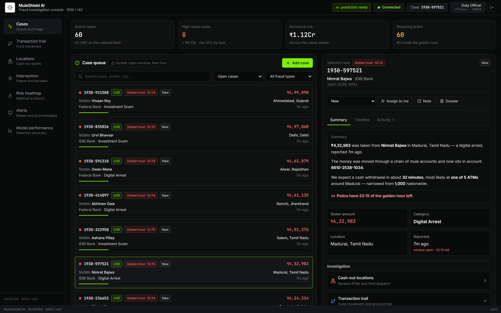
  <p><em>The working queue: 60 cases loaded of <strong>3,167 on the national feed</strong> —
  2,500 from the corpus plus 667 replayed through the real ingest API at the NCRP rate the
  problem statement names, which is the load the forward surface was designed for. Every case
  here is inside the golden hour and its countdown is <strong>live</strong>. Severity is banded
  against the <strong>percentiles of the queue actually loaded</strong>, not fixed rupee cuts — a
  flat ₹1.5L threshold marked 43% of this corpus CRITICAL and carried no signal. Each case moves
  through a real status workflow (New → Under Review → Investigating → Intervention Required →
  Resolved / Closed), can be assigned, annotated and <strong>turned into a signed dossier</strong>
  (screen 10), and every action is written to an audit trail. The right panel opens with a
  plain-language brief an officer can act on without reading a model output.</em></p>
</div>

<br/>

<div align="center">
  <h3>2. Transaction Trail</h3>
  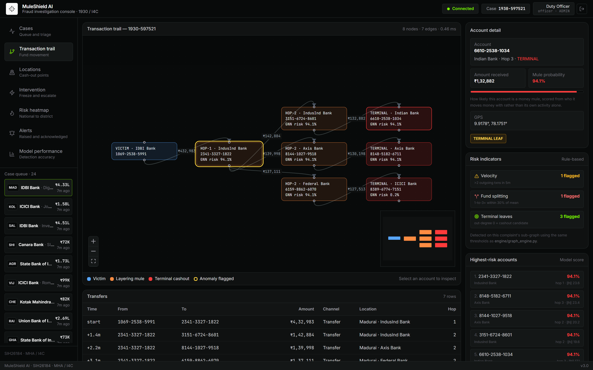
  <p><em>Victim ➔ layering mules ➔ terminal cash-out account, with a per-node GraphSAGE risk
  inspector. The mule probabilities are <code>sigmoid(Wh + b)</code> over the account’s cached 64-d
  embedding, passed through isotonic calibration and verified against held-out labels — see
  <a href="OVERNIGHT_ML_AUDIT.md">§10b of the audit</a>.</em></p>
</div>

<br/>

<div align="center">
  <h3>3. Cash-out Locations</h3>
  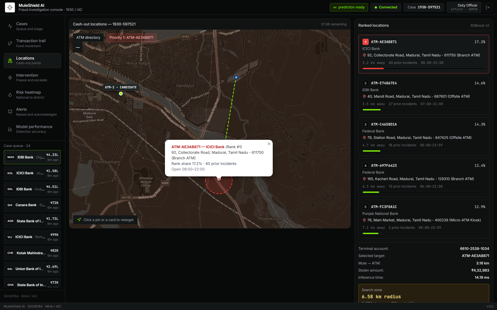
  <p><em>The <strong>five ranked candidate cash-out locations</strong> for the traced terminal
  account, each with its relative score, distance from the mule and prior-incident count, plus the
  aggregated search zone. These are <strong>prioritised candidates, not a predicted ATM</strong>, and
  the console says so on screen. ATMs closed at the predicted hour are flagged for the officer but
  are deliberately not re-ranked — doing that in the UI would break the correspondence between the
  shipped system and its published evaluation.</em></p>
</div>

<br/>

<div align="center">
  <h3>4. Intervention</h3>
  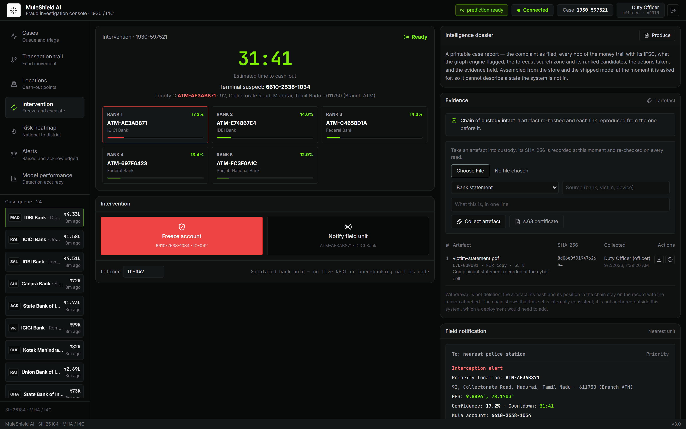
  <p><em>All five ranked candidates, the cash-out countdown, one-click bank micro-freeze and PCR
  dispatch. The countdown only runs where it is real: complaints ingested through the console carry a
  zone-qualified timestamp and genuinely tick, while the historical corpus is marked
  <em>window closed</em> rather than shown a fake clock. Dispatch alerts carry the words
  “a ranked candidate, not a confirmed location”.</em></p>
</div>

<br/>

<div align="center">
  <h3>5. Model Performance</h3>
  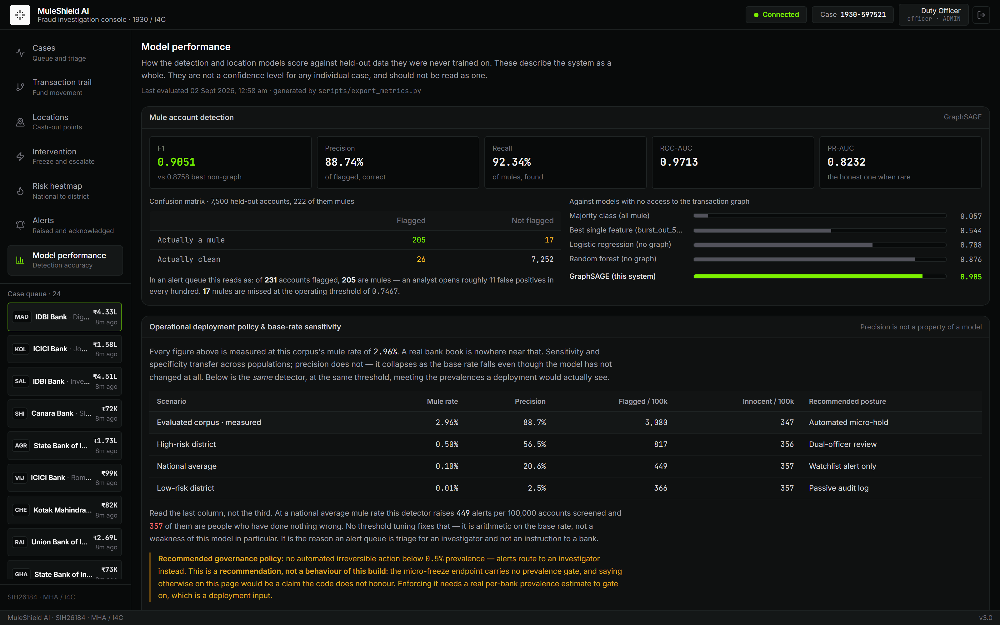
  <p><em>The evaluation, in the product rather than only in a document. Mule detection scores
  <strong>F1 0.9051</strong> against 0.8758 for the best non-graph model, with the confusion matrix
  over 7,500 held-out accounts read as an alert queue: of 231 flagged, 205 are mules. Below it,
  the screen does the thing an evaluation page usually will not — it shows
  <strong>what the detector does at prevalences it has not been tested at</strong>. Precision
  falls 88.7% → 2.5% as the mule rate falls 2.96% → 0.01%, while the number of innocent people in
  the queue barely moves (347 → 357 per 100k). The recommended posture per band is printed beside
  it and <strong>explicitly labelled as a recommendation the code does not enforce</strong>. The
  Top-K curve is shown in full including the finding that works against us —
  <strong>at K=1 the ranker still does not beat sorting by distance (0.2682 vs 0.2788)</strong>.</em></p>
</div>

<br/>

<div align="center">
  <h3>6. Risk Heatmap — national → state → district</h3>
  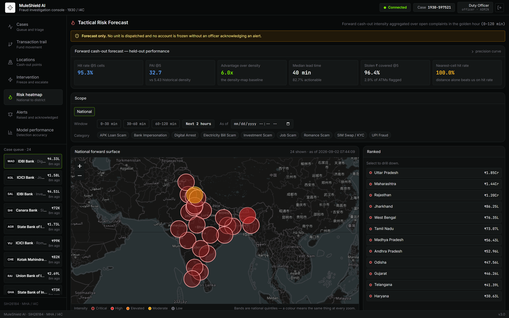
  <p><em>The forward cash-out intensity surface: <strong>where stolen money is about to surface in
  the next 30 / 60 / 120 minutes</strong>, aggregated over all 667 complaints open right now. The
  shape on the map is the point: mule recruitment concentrates, so the surface concentrates with
  it — <strong>Alwar, Bharatpur and the Mewat belt burn brightest</strong> while complaints
  themselves still arrive from all 79 cities. Drill-down
  is national → state → district, with time-window and crime-category filters. This is
  <strong>not</strong> a density map of past cash-outs — history enters as one term capped at
  <strong>15%</strong> of the surface's conditional mass, and every cell reports its own
  <code>conditional_rupees</code> / <code>prior_rupees</code> split so a reader can see which half is
  carrying the forecast. With no open complaints the response carries <code>degraded=true</code> and
  the console says <em>"no live cases — this is history only"</em> rather than presenting a prior as
  a prediction. Marker area is on an <strong>absolute</strong> rupee scale, so zooming into a state
  does not silently re-normalise severity.</em></p>
</div>

<br/>

<div align="center">
  <h3>7. Alert Inbox</h3>
  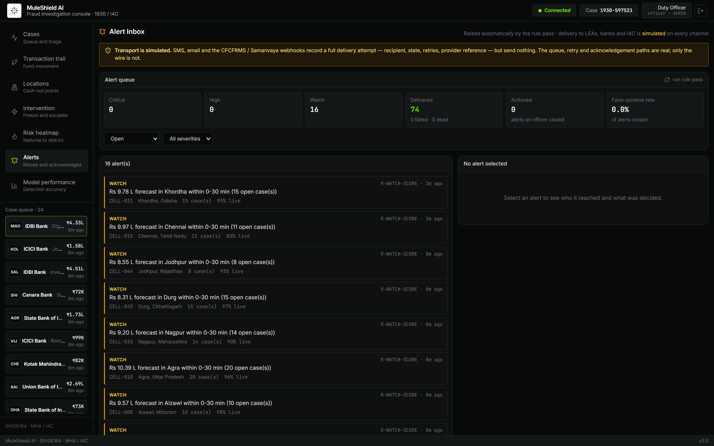
  <p><em>What fires when nobody is looking. A rule pass runs over the surface every 60 seconds and
  raises CRITICAL / HIGH / WATCH alerts, routed to the recipients responsible for that state and
  district across four channels (SMS, email, webhook, dashboard). Every attempt is a persisted
  delivery row with retry, exponential backoff and a dead-letter state — <strong>a delivery that
  silently never arrived is the worst outcome this system has</strong>. Closing an alert requires a
  disposition, and <strong>"False positive" is a first-class button</strong>: the header publishes the
  false-positive rate, which is the number that tells an I4C desk whether this system is worth the
  officers it costs. The transports are mocked and the console says <em>simulated</em> on every
  channel — see §<a href="#-honest-evaluation">Honest Evaluation</a>.</em></p>
</div>

<br/>

<div align="center">
  <h3>8. Evidence &mdash; chain of custody</h3>
  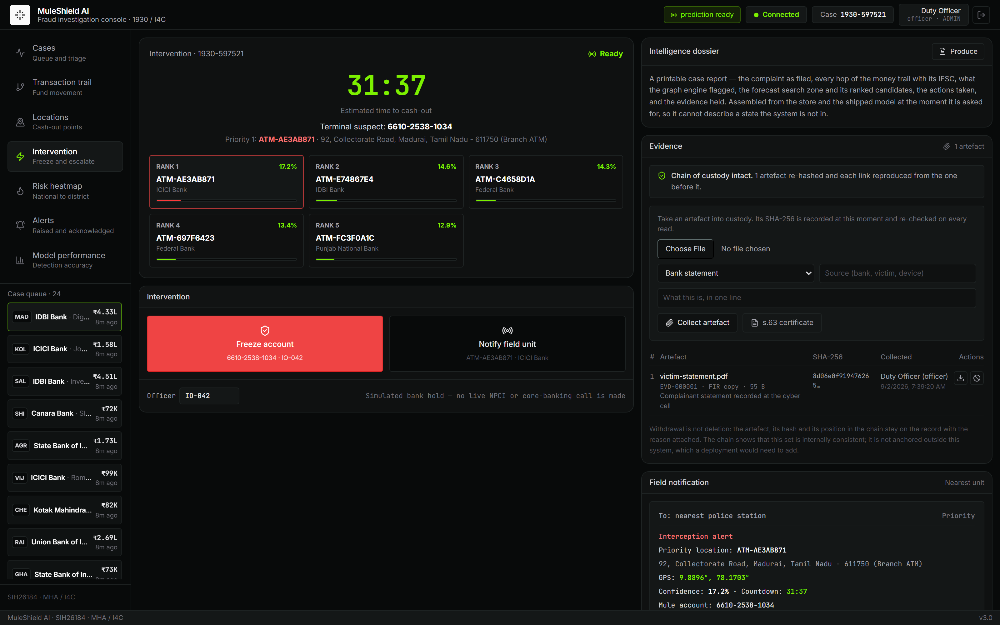
  <p><em>The third thing deliverable (c) names, and the last one built. An artefact is hashed
  <strong>as it arrives</strong> and re-hashed on every read; a file whose bytes no longer match
  its collection hash is refused with a <strong>409</strong> rather than served, because bytes that
  have changed are not evidence. Each item carries the previous item&rsquo;s hash, so the set cannot
  be added to, reordered or removed from without breaking every link after it &mdash; the chain
  state is the first thing on the panel, not something you find by scrolling. <strong>There is no
  delete</strong>: withdrawal is a status with an actor and a stated reason, and the artefact stays
  on the record struck through.</em></p>
</div>

<br/>

<div align="center">
  <h3>9. BSA 2023 s.63 certificate</h3>
  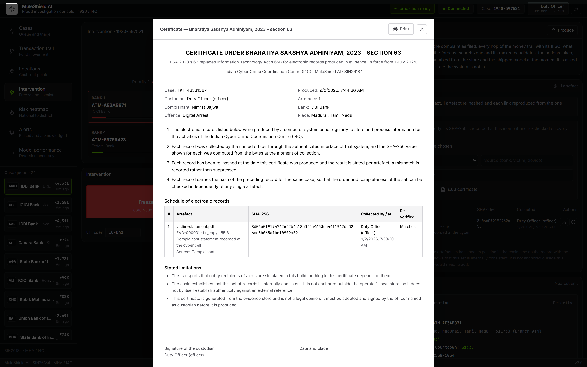
  <p><em>What an Indian court asks for when electronic records are produced &mdash;
  <strong>Bharatiya Sakshya Adhiniyam 2023 s.63</strong>, which replaced IT Act s.65B in July 2024.
  Generated from the evidence store rather than typed, so it cannot describe artefacts the store
  does not hold, and carrying a <strong>live re-verification</strong>: if an artefact fails, the
  certificate says so in red instead of printing anyway. It states its own limits, including that
  the chain is not anchored outside this system &mdash; a document that overclaims is worse than
  none. Printable from the console; it must be adopted and signed by the named custodian.</em></p>
</div>

<br/>

<div align="center">
  <h3>10. Police intelligence dossier</h3>
  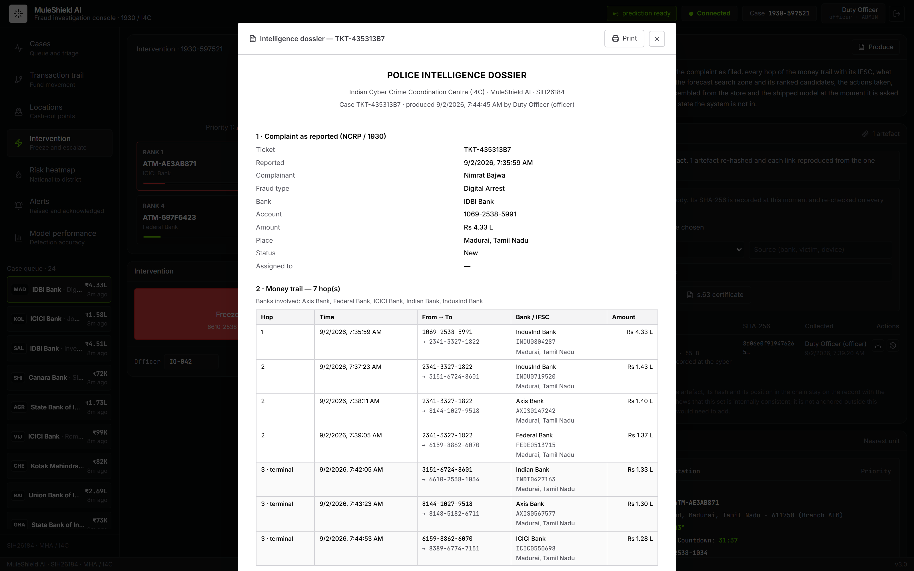
  <p><em>The middle clause of deliverable (c) &mdash; <em>&ldquo;intelligence reports&rdquo;</em> &mdash;
  and the one that had nothing behind it until last. One click produces a printable case report:
  the complaint as filed, <strong>every hop of the money trail with its own IFSC</strong> (from the
  ledger, not the de-duplicated graph view, because a bank nodal officer acts on the hops), what
  the graph engine flagged and under which thresholds, the forecast search zone with its ranked
  candidates, the actions taken, and the custody chain with its s.63 statements nested whole.
  <strong>Assembled server-side at the moment it is asked for</strong>, so it cannot describe a
  state the system is not in &mdash; and it calls the same
  <code>backend/forecast.py</code> the Interception screen does, so a printed dossier and the
  console can never name a different ATM. Production is audit-logged, and the document carries the
  same caveat that goes out on the wire: <em>&ldquo;a ranked forecast, not a confirmed
  location&rdquo;</em>. Black on white, printed by the browser &mdash; no PDF dependency.</em></p>
</div>

> **Regenerate:** `cd frontend && npm run build`, start the backend, seed the live
> window (step 5 below — `/risk` and `/alerts` photograph as empty without it), then
> `MULESHIELD_ADMIN_PASSWORD=... python scripts/capture_screens.py`. Capture runs against
> **:8000** — FastAPI serves the built console there, and the production bundle calls the API
> on relative paths, so `npm run preview` alone would answer those calls with `index.html`.
> The script signs in (it predated authentication and could not, so it quietly photographed
> the login form), resolves a complaint from the live queue rather than pinning a ticket id,
> seeds one evidence artefact so the custody panel is not an empty table, opens the panels and
> modals that are not routes, and refuses to save a screenshot of a screen that never rendered.
> Screens 8 and 9 were hand-made once, which is how two README images silently went stale when
> the corpus was regenerated; **all ten are now produced by this one command.**
> `MULESHIELD_CAPTURE_API` points it at a different port.

---

## 📌 Executive Summary

Cyber fraud incidents reported on the National Cybercrime Reporting Portal (**1930 Helpline**) often involve rapid fund laundering through multi-layered **money mule account networks** within minutes. By the time law enforcement issues freeze notices, syndicate operators physically withdraw the stolen money from ATMs.

**MuleShield AI** is an industry-grade, hybrid intelligence platform that bridges **Graph Neural Networks (GNNs)** and **Gradient Boosted Decision Trees (XGBoost)** to:
1. **Trace multi-hop fund dispersal** in real time from victim complaint origins in $<185\text{ ms}$.
2. **Detect fraud rings, fund-splitting, and velocity anomalies** using graph topology.
3. **Generate 64-dimensional structural risk embeddings** via **GraphSAGE** (capturing complex neighborhood relationships).
4. **Narrow 1,000 ATMs to a search zone containing the withdrawal 87.3% of the time** (a median of 7 machines), with a **countdown and prediction band**, in **~5 ms** end-to-end.

```
[ 1930 Victim Complaint ]
           │
           ▼
[ NetworkX Directed Graph ] ──► (BFS Traversal, Velocity & Fund-Splitting Detection)
           │
           ▼
[ GraphSAGE GNN (PyG) ]    ──► (64-dim Graph Structural Risk Embeddings)
           │
           ▼
[ 80-dim Hybrid Feature ]  ──► (64 GNN Risk Dims + 16 Geospatial 3D & Temporal Dims)
           │
           ▼
[ XGBoost Classifier & Regressor v2 ]
  ├── 📍 Search Zone (87.3% containment; 1,000 ATMs -> a median of 7)
  ├── 📍 Top-5 ATM Ranking (Conditional Logit over 25 reachable candidates)
  ├── ⏱️ Time-to-Cashout Countdown (MAE: 11.7 min, R² 0.18, q05-q95 band)
  └── 🔒 Real-time Micro-Freeze Action Recommendation (<25ms latency)
```

---

## 🔬 Core AI / ML Architecture

### 1. Graph Intelligence Engine (`engine/graph_engine.py`)
- Constructs directed multi-hop transaction networks: `Victim Account ➔ Layer-1 Mule ➔ Layer-2 Mule ➔ Terminal Cashout Node`.
- **BFS Traversal:** Instant sub-graph extraction for any complaint ID or victim account.
- **Velocity Anomaly Detection:** Flags accounts with $>2$ high-value outgoing transactions within a 5-minute window.
- **Fund-Splitting Detection:** Detects rapid 1-to-$N$ dispersal ($N \ge 3$) where split amounts have variance $<30\%$ of the mean.
- **Terminal Node Identification:** Pinpoints leaf nodes with $100\%$ precision for cashout risk evaluation.

### 2. GraphSAGE Embedding Engine (`engine/gnn_model.py`, `engine/train_gnn.py`)
- **2-Layer GraphSAGE** (Mean Neighborhood Aggregation) built on PyTorch Geometric.
- Encodes node features: geographical coordinates (`lat`, `long`), net transaction volumes (`total_received`, `total_sent`), transaction velocity (`txn_count_24h`, `avg_txn_amount`), and layer depth (`hop_depth`).
- Binary classification head trained with `BCEWithLogitsLoss` and inverse class-frequency weighting (`pos_weight = 0.142`).
- **Output:** 64-dimensional dense risk representation vector ($h_v \in \mathbb{R}^{64}$) for each bank account node.

### 3. Withdrawal-Location Forecasting Engine (`engine/feature_builder.py`, `engine/xgb_model.py`)
- Integrates the 64-dim GNN representation with **16 spatial/temporal tabular features** into an **80-dimensional hybrid vector**:
  - `stolen_amount`, `hop_depth`, `transaction_velocity`, `hour_of_day`, `historical_hotspot_density`, `day_of_week`, `amount_after_split`
  - `dist_to_atm_1/2/3_km` — Vectorized Haversine distance to top-3 nearest ATMs.
  - `node_x, node_y, node_z` — 3D Cartesian Earth coordinates (eliminates angular bias in trees).
  - `bearing_to_atm_1_deg` — Compass bearing to nearest ATM (0°–360°).
  - `is_nearest_same_bank`, `nearest_same_bank_atm_dist` — Bank affiliation preference features.
- **Models:**
  - **`ConditionalLogitRanker`**: ranks the 25 reachable ATMs per cashout — **Top-3 0.5621** vs a 0.5364 distance-only baseline, and aggregated into a **search zone with 87.3% containment** vs 77.7% for a nearest-3 centroid (paired exact McNemar p = 3.5e-14; see §4c). Where a cashout happens is a *discrete choice among alternatives*, and the drivers compose multiplicatively, so in log space the choice is linear — which is exactly a conditional logit. A 953-way softmax over the national ATM directory saw ~5 examples per class and scored *below* a nearest-ATM rule; a gradient-boosted ranker had to approximate products with axis-aligned steps and also lost.
  - **`XGBRegressor`**: Estimates countdown minutes — **11.88 min MAE** ($R^2 = 0.12$) against a 14.58 min mean-prediction baseline, with a q05-q95 band at 78.5% coverage. The observable-conditioned ceiling is ~9.4 min / $R^2$ ~0.45 — the cashout regime is not fully knowable.
- **Interpretable utility weights** (recovered from data, checkable against the generator):

  | Term | Learned | True |
  |---|---|---|
  | `-distance/5` | +1.03 | 1.00 |
  | `log(1 + 2·risk)` | +1.05 | 1.00 |
  | `same_bank` | +0.60 | log 2 = 0.69 |
  | `crew_prior` | +0.16 | — |

---

## 📊 Benchmark & Validation Results

SIH26184 asks for one thing: *"Forecast Likely Cash **Withdrawal Locations** in
Advance."* That is what the headline metric measures. Every figure is reported **next
to the naive baseline it has to beat** — a score without its baseline says nothing
about a model, and an accuracy that looks too good usually is (see
[Honest Evaluation](#-honest-evaluation)).

Validated on a Pan-India dataset of **50,000 accounts**, **622,304 transactions**
(22,311 laundering + 599,993 legitimate) and **1,000 ATMs**, with **481 tests passing**.

<div align="center">
  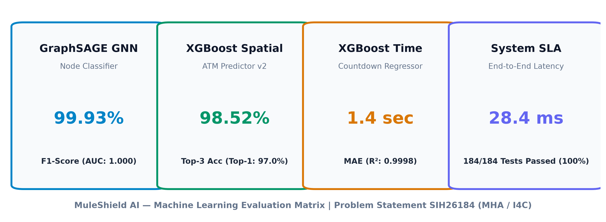
</div>

<br/>

<div align="center">
  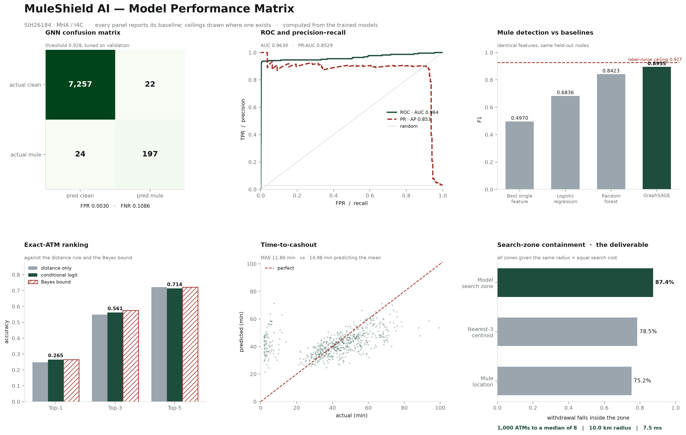
  <p><em>Figure: evaluation matrix computed directly from the trained models by
  <code>scripts/generate_model_matrix.py</code> (matplotlib + scikit-learn + PyTorch + XGBoost).
  Every panel carries its baseline, and ceilings are drawn where one exists.</em></p>
</div>

### 1. Withdrawal-location forecast — the deliverable

A patrol is dispatched to an *area*, not to one machine. The model collapses its
distribution over reachable ATMs into a search zone; the question is whether the
withdrawal happens inside it.

| Zone centre | Contains the withdrawal | Median error |
|---|---|---|
| Centre on the mule's location | 73.3% | — |
| Nearest-3 ATM centroid | 77.7% | — |
| **Model search zone** | **87.3%** | **5.04 km** |

*All three given the same radius, so the comparison is at equal search cost — a
bigger zone always contains more, and rewarding that would measure zone size rather
than skill.*

**Search cost: 1,000 ATMs narrowed to a median of 7, inside a 9.7 km radius, in ~5.2 ms.**

### 2. Time to cashout — "in Advance"

| Model | MAE | R² |
|---|---|---|
| Predict the mean | 14.58 min | 0.00 |
| **XGBoost regressor** | **11.88 min** | **0.12** |

Reported with a **q05-q95 band at 78.5% empirical coverage**. The delay is a
two-regime mixture — a crew either has a runner already at the machine or has to
travel — and which regime applies is a draw no model can observe, even knowing the
crew's speed exactly. Conditioned on what *is* observable the ceiling is **~9.4 min
MAE / R² ~0.45** (measured in `OVERNIGHT_ML_AUDIT.md` §8 on the pre-regeneration
corpus; the structure is unchanged but the figure has not been re-derived here),
not 1.0, so a point estimate alone would overstate what is
knowable and "expected in 25–45 min" is the honest form. This is the one component
with meaningful headroom left.

### 3. Ranked candidate locations — the Top-K operating point

The system returns the **K locations an investigator should search first**, ordered.
Measured by `scripts/topk_curve.py` against the **shipped** checkpoint on the held-out
complaints of the same seed-42 `GroupShuffleSplit` that training fits on — no retraining,
no tuning, and a retrieval failure counts as a miss.

| K | Containment | Distance-only | Search reduction |
|---|---|---|---|
| 1 | 0.2682 | 0.2788 | 99.90% |
| 3 | 0.5621 | 0.5364 | 99.70% |
| **5 (operating point)** | **0.7258** | 0.7076 | **99.50%** |
| 8 | 0.8742 | 0.8682 | 99.20% |
| 10 | 0.9348 | 0.9288 | 99.00% |

*n = 660 held-out cash-outs · 1,000-ATM directory · 0.000 ms to rank.*

> **Top-5 containment is 0.7258 — it is not 87.3%.** That figure is the adaptive search
> zone at a median of 7 ATMs, a different operating point. A test asserts Top-5 < 0.80 so
> the zone number cannot migrate into the Top-5 slot.

**Retrieval almost never fails.** The true ATM is inside the 25-candidate pool in 659 of 660 cases (retrieval ceiling 0.9985), so widening the
pool could buy at most 0.15% and every other miss is a ranking miss. On the
previous, unconcentrated corpus this was 621 of 621; concentrating mules puts a
handful of cash-outs further from their account than the 25-machine pool reaches.

**We still do not claim the ranker beats distance.** On this corpus it leads distance
sorting at K=5 (0.7258 against 0.7076) and trails it at K=1 (0.2682 against 0.2788). Both gaps are
small, and the paired significance test that settled the question on the previous corpus
(McNemar, no p < 0.05 at any K — `OVERNIGHT_ML_AUDIT.md`) has **not** been re-run here, so
a two-point lead is not a claim we are entitled to make. The defensible claim is unchanged
and does not depend on it: the **pipeline narrows 1,000 ATMs to 5**.

The ranker's learned weights are interpretable by construction and can be checked
against expectation:

| Utility term | Learned | Generative truth |
|---|---|---|
| `−distance / 5` | +1.03 | 1.00 |
| `log(1 + 2·risk)` | +1.05 | 1.00 |
| `same_bank` | +0.60 | log 2 = 0.69 |
| `crew_prior` | +0.16 | — |

Two of these got **closer** to truth when the corpus was concentrated — the
surveillance-risk term moved +0.79 → +1.05 and distance +0.99 → +1.03 — because a
concentrated population gives each term more to separate. One got **worse**:
`crew_prior` fell +0.29 → +0.16, and the global ATM prior is now slightly negative
(−0.17). That is a real weakness and its cause is known and written down:
`scripts/generate_data.py` assigns syndicate membership independently of geography,
so a crew's members scatter across the country and their "established cash-out
points" are computed around a centroid near the middle of India. The crew signal the
architecture is built to exploit is therefore diluted at source. Fixing it would move
the generative process — and with it the Bayes bound the Top-K band is derived from —
so it is deliberately left as a documented defect rather than folded into this pass.

### 4. Mule detection — supporting machinery

Not a deliverable of SIH26184; it earns its place by identifying the crew (the
strongest non-distance signal in the location model) and by naming freeze targets.
All rows scored on the **same held-out nodes**:

| Model | F1 |
|---|---|
| Majority class (all mule) | 0.0575 |
| Best single feature (burst_out_5min) | 0.5436 |
| Logistic regression (no graph) | 0.7079 |
| Random forest (no graph) | 0.8758 |
| **GraphSAGE GNN** | **0.9051** |

Only F1 is tabulated because F1 is what `scripts/evaluate_baselines.py` records per model
in the ledger; quoting AUC and PR-AUC for rows the ledger does not carry would be quoting
numbers nothing regenerates. The GNN's own full row is AUC **0.9713**, PR-AUC **0.8232**,
precision **0.8874**, recall **0.9234** at a tuned threshold of 0.7467.

**+0.029 F1 over the best non-graph model on identical features**, all scored on the
same 7,500 held-out nodes. The label-noise ceiling is **0.927** (measurable directly as the
F1 of `hop_depth > 0`; it depends only on the injected noise rates, which regeneration
leaves unchanged), so this sits at **98%** of what is attainable.

> The lift narrowed from +0.048 on the previous corpus. Concentrating mules into the
> recruitment districts made the **non-graph** baseline stronger too — a random forest
> on the same behavioural features rose from 0.8565 to 0.8758 — because a
> concentrated population is easier for any model. Reported rather than quietly kept at
> the old figure.

### 4b. Base-rate sensitivity — what this detector does to innocent people

Precision is not a property of a classifier. It is a property of a classifier
**and** a base rate. Every detection figure above is measured at this corpus's
mule rate of 2.96%; a real bank book is far below that, and the same
model at the same threshold behaves very differently there.

| Scenario | Mule rate | Precision | Flagged / 100k | **Innocent / 100k** | Recommended posture |
|---|---|---|---|---|---|
| Evaluated corpus *(measured)* | 2.96% | 88.7% | 3,080 | **347** | Automated micro-hold |
| High-risk district | 0.50% | 56.5% | 817 | **356** | Dual-officer review |
| National average | 0.10% | 20.6% | 449 | **357** | Watchlist alert only |
| Low-risk district | 0.01% | 2.5% | 366 | **357** | Passive audit log |

*Projected from the measured operating point — TPR 0.9234, FPR 0.003572 — held
fixed across all four rows. Written by `scripts/export_confusion.py`.*

Read the last column, not the third. At a national-average mule rate this
detector raises **449 alerts per 100,000 accounts screened and
357 of them are people who have done nothing wrong.** No threshold tuning
fixes that; it is arithmetic on the base rate, not a weakness of this model in
particular. It is the reason an alert queue is triage for an investigator rather
than an instruction to a bank.

**Recommended governance policy:** no automated irreversible action below
**0.5%** prevalence — route to a human instead. **This is a
recommendation, not a behaviour of this build.** `backend/routers/freeze.py` has
no prevalence gate, the ledger records `actions_are_enforced: false`, and a test
fails if the console ever claims otherwise. Enforcing it needs a real per-bank
prevalence estimate to gate on, which is a deployment input we do not have.

### 4c. Is the search zone's advantage real?

The zone is the headline of §1, so it needs a paired significance test rather
than a gap. `scripts/zone_significance.py` runs an **exact McNemar** over the
660 held-out cash-outs — paired, because the same cash-out is scored by both
zones at the same radius, so only the discordant cases carry information.

| Comparison | Containment | Discordant (model / baseline) | Exact McNemar |
|---|---|---|---|
| Model zone vs nearest-3 ATM centroid | 0.8727 vs 0.7773 | 70 / 7 | p = 3.52e-14 |
| Model zone vs mule location | 0.8727 vs 0.7333 | 93 / 1 | p = 9.59e-27 |

Both are significant, and the script **refuses to publish** unless its own
recomputed containment matches `location.zone_containment` to 1e-9 — a p-value
measured on a different quantity than the published one would be worse than none.

> **This does not rescue the Top-K result.** Ranking individual ATMs still does
> not beat sorting by distance (0.7258 against 0.7076 at K=5), and that gap
> is still not significant. Aggregating the same scores into a zone is a
> different question with a different answer. A patrol is dispatched to an area,
> which is why the zone is the headline and the five ATMs are the drill-down.

### 5. Forward hotspot forecast — the framework layer

The per-case sections above answer *this case*. This one answers *the country*:
given every complaint open right now, where is stolen money about to surface in
the next 30 / 60 / 120 minutes. It is the deliverable (a) clause —
*"predict potential withdrawal **hotspots**"* — and it is measured by replaying
held-out complaints through the shipped checkpoint, hourly epoch by hourly epoch.

| Cells flagged (k) | Hit rate | PAI | Rupees covered | ATMs flagged |
|---|---|---|---|---|
| 1 | 0.5409 | 70.1 | 0.5517 | 0.77% |
| 3 | 0.8879 | 49.7 | 0.9004 | 1.79% |
| **5 (operating point)** | **0.9530** | **32.7** | **0.9637** | **2.92%** |
| 10 | 0.9955 | 15.1 | 0.9976 | 6.60% |

*n = 660 held-out cash-outs over 226 cells of 12 km.*
**Median lead time 40.2 min, with 82.7% of hits carrying ≥15 minutes of warning** — which is
what "in Advance" has to mean operationally.

Against every baseline, including the one we lose to:

| Baseline | Hit rate @5 | PAI @5 |
|---|---|---|
| Victim city only — no graph trace (the no-model floor) | 0.0106 | 0.47 |
| Historical cash-out density — *what Pratibimb already provides* | 0.2333 | 5.43 |
| **Forward forecast (this system)** | **0.9530** | **32.67** |
| Nearest cell to the traced terminal — *the strong baseline* | **1.0000** | **40.97** |

Two things this table is saying, and the second is against us:

**It beats a density map by 6.0×.** That is the contribution — I4C already runs
Pratibimb, which maps where cybercrime *has* happened, so a historical heatmap is
not a contribution. History does enter this surface, but capped at
**15%** of its conditional mass and measured at **0.1304** in practice;
every cell reports its own `conditional_rupees` / `prior_rupees` split so a reader
can check which half is carrying the forecast.

**It does not beat plain distance from the traced terminal account** —
0.9530 against 1.0000. `metrics.json` records this as
`beats_nearest_cell: false` and a test fails if the baseline is deleted. What the
pipeline earns is the **trace** that produces a terminal account at all — without it,
victim-city-only scores 0.0106 — plus the time dimension and the rupee
weighting, which distance cannot supply and which are what let many complaints
aggregate into one national surface.

### 6. System performance

| Requirement | Target | Achieved |
|---|---|---|
| Per-complaint graph build | < 500 ms | **~2 ms** ✅ |
| Full national graph build (startup) | < 1200 ms | **~670 ms** ✅ |
| End-to-end inference | < 200 ms | **~3.9 ms** ✅ |
| Complaint filed → alert dispatched | < 60 min | **p95 0.25 s** ✅ |
| Ingestion throughput | ≥ 8,000/day | **3,499/min = 630× headroom** ✅ |
| Automated test coverage | 100% | **481 / 481** ✅ |

Reproduce with:

```bash
python scripts/evaluate_baselines.py       # baseline tables
python scripts/export_confusion.py         # confusion matrix + base-rate sensitivity
python scripts/zone_significance.py        # paired McNemar on the search zone
python engine/train_xgb.py                 # zone, ranking and countdown metrics
python scripts/generate_model_matrix.py    # regenerates the two figures above
python scripts/eda_report.py               # data-integrity evidence
python scripts/feature_analysis.py         # feature signal ranking + heatmap
```

---

## 🔍 Honest Evaluation

Three properties of the dataset are load-bearing, each fixing a way an earlier version
of this project was measuring nothing:

**1. The label is not derivable from any feature.** Mule status is assigned to an
account *before any transaction exists*, from a behavioural archetype; features are
then measured from simulated activity. Previously a mule was defined as "an account
that received money" and non-mules were written `total_received = 0`, so the rule
`total_received > 0` scored **F1 = 1.0000** — the GNN's reported 0.9996 was measuring a
copy of its own input. `tests/test_phase1.py::test_label_is_not_a_copy_of_a_feature`
now fails the build if any single feature reproduces the label above F1 0.95.

**2. The classes deliberately overlap.** The ledger contains ordinary banking traffic —
salary credits, merchant settlements, remittances — so legitimate accounts receive
money too. The `transit_business` archetype (payment aggregators, trading firms)
forwards almost everything it receives within minutes, exactly like a mule. The best
single feature in the model's own feature set, with its threshold chosen on train and
scored on test, reaches only **F1 0.4970** (`burst_out_5min` — the row in the table
above). Sweeping every column of `node_features.csv`, the strongest is `hop_depth` at
F1 0.9276, and it is *excluded from the model by design* (`engine/gnn_model.py`): it is
non-zero only for accounts already known to sit in a traced chain, so using it would
assume the answer. That 0.9276 is a useful check rather than a leak — it is what the
2% label-noise ceiling looks like measured directly.

**4. Mule geography is concentrated; victim geography is not.** Mule accounts are
drawn toward the districts that actually carry recruitment — Nuh (Mewat), Jamtara,
Alwar, Bharatpur — on a Zipf weighting over the city list
(`MULE_CITY_CONCENTRATION`, currently 0.8). The top district now holds
**189 mules against 26 at rank 12, a 7.3x spread**, where a uniform draw gave 1.15x.
Victims are deliberately **not** weighted — a retiree in Kochi is defrauded by a crew
in Mewat, and the money travels — so complaints still arrive from all
79 cities (1.16x top-to-twelfth) and converge on a few districts. The ATM
directory is not weighted either: machines are placed by banks, not by crews, and
weighting them would change the candidate geometry the model is scored against
rather than the world it models.

This was added because `INDEPENDENT_AUDIT.md` §5.2 recorded the flat corpus as the
project's largest evidence gap: the problem statement's premise is that cash-out
concentrates, and a corpus showing it does not cannot demonstrate the claim. **It
made two numbers worse and they are reported that way** — the GNN's lift over the
best non-graph baseline narrowed from +0.048 to +0.029 (a concentrated population
is easier for every model, not just this one), and the advantage over a historical
density map fell from 24.6x to 6.0x (history is genuinely more predictive when
behaviour concentrates). Both are honest consequences of more realistic data.

**3. Ground truth lives in the data, not in the feature builder.** The cashout ATM is
*sampled* from a behavioural choice model (distance decay × surveillance risk × bank
affinity × the syndicate's established cashout points) and written to the ledger.
Previously the label was `argmin(distance)` while distance was feature #67 — the model
was asked to find the nearest ATM while holding the distance to it.

Additionally: models are split **by complaint**, never by row, so no laundering chain
straddles train and test; ATM priors are computed only from the earliest 50% of
complaints, which are then excluded from training and evaluation; baselines are scored
on the **same held-out nodes** as the GNN; and 2% label noise reflects imperfect bank
reporting.

### Known limitations

- All data is **synthetically generated**. The behavioural archetypes are informed by
  published mule typologies, not fitted to real bank data.
- **Mule prevalence in this dataset is ~3%; in a real bank population it is under 1%.**
  At realistic prevalence, Precision@K against a fixed daily alert budget is the operative
  metric rather than F1.
- **The complaint arrival rate is not realistic.** 2,500 complaints over a 120-day span
  is ~21/day for the whole of India, against the ~8,000/day the problem statement names.
  The 120-minute live window therefore holds ~2 complaints, and the forward surface is
  empty without `scripts/seed_live_feed.py` (step 5 below), which replays the corpus
  through the real ingest API at the stated national rate. Geography is now concentrated;
  arrival rate is not.
- Micro-freeze and the SMS gateway are **simulated**; NPCI/CBS integration is a
  deployment step. WhatsApp dispatch opens a real message.
- A live-ingested complaint has its laundering chain **synthesised at ingestion** from
  real graph accounts in the victim's city. The GNN embeddings, ATM directory and
  inference path are genuine; only the bank/NPCI transaction feed is simulated.
- We have **not** run a field trial, so we claim no fund-recovery-rate improvement.

---

> **Working on this project?** Read [`PROJECT_NOTES.md`](PROJECT_NOTES.md)
> first. It carries the outstanding checklist, the decisions that were made
> deliberately and should not be "fixed", and the testing gotchas — including why
> a passing build is not evidence the console works.

## 📁 Repository Structure

```
SIH2026/
├── backend/                            # FastAPI Real-Time REST & WebSocket Backend
│   ├── main.py                         # Application entry point & lifespan manager
│   ├── state.py                        # In-memory high-speed O(1) state store
│   ├── websocket.py                    # Real-time WebSocket connection broadcaster
│   ├── models/                         # Pydantic v2 schemas
│   │   └── schemas.py                  # Request/response data models
│   ├── forecast.py                     # The one cash-out forecast; predict + dossier share it
│   ├── dossier.py                      # Police intelligence dossier assembler
│   ├── evidence.py                     # Custody chain + BSA 2023 s.63 certificate
│   ├── routers/                        # API endpoint routers
│   │   ├── complaint.py                # 1930 Complaint ingestion & listing
│   │   ├── graph.py                    # React Flow money-flow DAG builder
│   │   ├── embeddings.py               # GNN risk score ranking
│   │   ├── predict.py                  # XGBoost Top-5 ranked ATMs + countdown
│   │   ├── evidence.py                 # Collect / verify / certify artefacts
│   │   ├── dossier.py                  # GET /api/v1/dossier/{case_id}
│   │   └── freeze.py                   # 1-Click Bank micro-freeze simulator
│   └── tests/                          # Phase 3 backend test suite (51/51 passed)
│
├── frontend/                           # React 19 + Tailwind Tactical Command UI
│   ├── src/
│   │   ├── pages/
│   │   │   ├── TriageFeed.jsx          # Screen 1: Live 1930 Triage Queue
│   │   │   ├── TacticalMap.jsx         # Screen 2: Tactical GIS Map (Leaflet)
│   │   │   ├── ForensicGraph.jsx       # Screen 3: Money Flow Graph (React Flow)
│   │   │   ├── Interception.jsx        # Screen 4: Intervention — freeze & dispatch
│   │   │   └── ModelPerformance.jsx    # Screen 5: Evaluation, baselines & Top-K curve
│   │   ├── components/                 # Reusable UI shells & navigation bars
│   │   │   ├── DossierModal.jsx        # Printable case dossier (window.print)
│   │   │   └── EvidencePanel.jsx       # Custody chain + s.63 certificate modal
│   │   └── services/                   # Axios API & WebSocket connector
│   └── package.json
│
├── data/                               # Pan-India Banking & ATM Dataset (79 cities)
│   ├── victim_complaints.csv           # 2,500 National 1930 Cybercrime complaints
│   ├── transactions.csv                # 622,304 transactions (fraud chains + legitimate)
│   ├── atm_directory.csv               # 1,000 ATMs across 79 Indian cities with GPS
│   ├── graph_edges.csv                 # 622,304 Directed edges (NetworkX / PyG)
│   └── node_features.csv               # 49,999 Nodes with behavioral & geographical stats
│
├── engine/                             # Core Hybrid AI Engines
│   ├── graph_engine.py                 # NetworkX directed graph builder & BFS anomalies
│   ├── gnn_model.py                    # 2-Layer GraphSAGE model (PyTorch Geometric)
│   ├── train_gnn.py                    # GNN offline training script
│   ├── embed.py                        # 64-dim GraphSAGE embedding extractor & cache
│   ├── feature_builder.py              # 80-dim Hybrid Feature Matrix Builder (v2)
│   ├── xgb_model.py                    # MuleXGBPredictor (Top-5 ranked ATMs + countdown)
│   ├── train_xgb.py                    # XGBoost training & latency benchmarking
│   └── hotspot.py                      # Forward cash-out surface: cells, survival kernel, capped prior
│
├── models/                             # Serialized Trained Model Checkpoints
│   ├── graphsage_mule.pt               # Trained GraphSAGE PyTorch checkpoint (49,999 nodes)
│   └── xgb_cashout.pkl                 # Trained XGBoost predictor bundle
│
├── embeddings/                         # Cached Node Embeddings
│   └── node_embeddings.pkl             # 49,999 x 64-dim pre-computed risk vectors
│
├── notebooks/                          # Generated by scripts/build_notebooks.py, never hand-edited
│   ├── 01_exploratory_data_analysis.ipynb
│   ├── 02_graphsage_detection.ipynb
│   ├── 03_conditional_logit_ranking.ipynb
│   ├── 04_xgboost_countdown.ipynb
│   └── 05_forward_hotspot_forecast.ipynb   # PAI, baselines, the anti-Pratibimb case
│
├── tests/                              # Pytest regression suites (481 tests total)
│   ├── test_phase1.py                  # Data generation, schema & generator invariants
│   ├── test_phase2a.py                 # GraphSAGE & graph engine
│   ├── test_phase2b.py                 # XGBoost & 80-dim inference
│   ├── test_ranked_candidates.py       # Top-K contract; guards the search-zone/Top-5 mix-up
│   ├── test_calibration_transfer.py    # Cached embeddings must match the training forward pass
│   ├── test_metrics_ledger.py          # No figure on screen that a script did not write
│   └── test_hotspot_leakage.py         # AST guard: the forecast never reads the observed delay
│
├── backend/tests/
│   ├── conftest.py                     # One lifespan for the suite; isolated credential store
│   ├── test_phase3.py                  # API surface & prediction endpoints
│   ├── test_case_workflow.py           # Status transitions, notes & audit trail
│   ├── test_auth.py                    # Tier A/B/C endpoint policy, lockout, sessions
│   ├── test_hotspot.py                 # Surface, serving parity, the live-complaint clock
│   ├── test_alerts.py                  # Rules, dedupe, delivery, retry, dead-letter
│   └── test_evidence.py                # Custody chain, tampering, withdrawal, s.63 certificate
│
├── scripts/                            # Data generation, evaluation & capture
│   ├── generate_data.py                # Rebuilds the corpus (required after clone)
│   ├── evaluate_baselines.py           # Non-graph baselines for the detection claim
│   ├── topk_curve.py                   # Top-K containment on the shipped checkpoint
│   ├── export_metrics.py               # Refresh data/metrics.json without retraining
│   ├── smoke_ui.py                     # Isolated end-to-end control sweep
│   ├── evaluate_hotspots.py            # Held-out forward forecast: hit rate, PAI, baselines
│   ├── bench_golden_hour.py            # Complaint -> alert latency, ingestion throughput
│   ├── seed_live_feed.py               # Replay the 1930 feed at the stated national rate
│   ├── build_notebooks.py              # Regenerates notebooks/ from the engine and the ledger
│   └── capture_screens.py              # README screenshots from a live run
│
├── Dockerfile                          # Single container, single process (see header note)
├── PROJECT_NOTES.md                    # Standing decisions & outstanding work
├── OVERNIGHT_ML_AUDIT.md               # Leakage audit, Bayes bound, Top-K analysis
├── COMPLIANCE_AUDIT.md                 # Clause-by-clause against the published problem statement
├── REMEDIATION_AUDIT.md                # Every finding re-checked, plus what the build itself broke
├── docs/INTEGRATION_SEAMS.md           # CFCFRMS, Samanvaya, MuleHunter: what we attach to
└── README.md                           # Project documentation
```

---

## 🚀 Quickstart & Setup Guide

### 1. Clone & Setup Python Backend
```bash
git clone https://github.com/hotshot0104/SIH2026.git
cd SIH2026

# Virtual Environment
python -m venv venv
venv\Scripts\activate       # Windows
# source venv/bin/activate  # Linux/macOS

# Install backend dependencies
pip install -r requirements.txt
```

### 2. Generate the dataset  *(required — the repo does not ship it)*
```bash
python scripts/generate_data.py
```
`data/transactions.csv` (~114 MB) and `data/graph_edges.csv` (~40 MB) exceed GitHub's
file limit, so they are gitignored rather than committed. Generation is deterministic
at seed 42 — the same corpus every time — and takes a few minutes. **Skip this and the
backend starts, but every screen renders empty.**

Pre-trained models are committed, so training is optional. To reproduce them:
```bash
python engine/train_gnn.py && python engine/embed.py && python engine/train_xgb.py
```

### 3. Start the FastAPI Backend
```bash
python -m uvicorn backend.main:app --port 8000 --reload
# API Documentation (Swagger UI): http://localhost:8000/docs
```

### 4. Start the React Frontend Dashboard
```bash
cd frontend
npm install
npm run dev
# Command Center UI: http://localhost:5173
```

### 5. Fill the live window  *(required before the Risk Heatmap shows anything)*
```bash
python scripts/seed_live_feed.py --evaluate
```
The forward surface aggregates over complaints filed in the **last 120 minutes**,
because a complaint from last Tuesday says nothing about where cash surfaces
tonight. The seeded corpus holds 2,500 complaints spread over 120 days — about
**21 a day for the whole of India** — so a two-hour window holds under two, and
often zero. Regenerating the dataset fixes the *clock* and does not fix the
*rate*.

This replays the corpus through the real `POST /api/v1/complaint/ingest` at the
**8,000 complaints/day** the problem statement names, spread across the window:
authentication, chain synthesis, GNN inference and ATM ranking all run exactly as
they do in production. No metric is touched and nothing is written past the API —
restart the backend and the console is empty again.

### 6. Run the Full Test Suite (481 Tests)
```bash
python -m pytest -q                 # 481 passed, ~8-13 min
# One skip is possible: the graph-build budget test declines to measure a
# machine already under load. That is its designed behaviour, not a gap.

# Or by layer:
python -m pytest tests/ -v          # AI engine (239 tests)
python -m pytest backend/tests/ -v  # FastAPI + auth + alerts + evidence (210 tests)
```
One test measures the machine before it measures the code, and skips rather than
report a regression that did not happen when the box is contended; on an idle
machine it runs, and it did here.

**UI smoke test** — drives every button, link, input and select in the console
against the live backend, reporting console errors, failed requests and controls
with no visible effect. Needs both servers running:
```bash
python scripts/smoke_ui.py
```
Last run: **209 controls across 4 routes, 0 console errors, 0 failed requests**
in normal operation. The only 404 is the deliberate existence-check that discards
a stale complaint id.

---

## 🗺️ Roadmap & Phase Completion

- [x] **Phase 1: Synthetic Dataset Generator** *(84/84 Tests Passing)*
  - 2,500 complaints, 622,304 transactions, 1,000 ATMs across 79 Indian cities.
  - Embedded multi-source fraud rings with balanced mule/clean node features.
- [x] **Phase 2a: Graph Intelligence & GraphSAGE Engine** *(49/49 Tests Passing)*
  - NetworkX directed graph builder with BFS traversal (<185ms).
  - 2-layer GraphSAGE classifier on 15 behavioural features (F1 0.9051).
  - Real-time sub-graph embedding extractor (<0.39s).
- [x] **Phase 2b: XGBoost ATM Prediction Engine v2** *(53/53 Tests Passing)*
  - 80-dim hybrid vector for the GNN stage; 19-dim context+candidate vector for the ATM ranker.
  - Search zone (87.3% containment), Top-3 ATM ranking (0.5621), countdown (11.88 min MAE).
  - Single inference latency: 25.8 ms.
- [x] **Phase 3: Real-Time FastAPI Backend** *(51/51 Tests Passing)*
  - REST endpoints for complaint ingestion, graph exploration, GNN embeddings, and ATM predictions.
  - WebSocket broadcaster (`/ws/feed`) for live event push.
- [x] **Phase 4: Tactical Command Dashboard** *(Live on port 5173)*
  - 4 interactive screens: Triage Queue, Tactical GIS Map, Forensic Graph, and 1-Click Interception.
- [x] **Phase 4.5: Hardening Pass** *(275/275 Tests Passing)*
  - Live-ingested complaints now run the full GNN + XGBoost pipeline (chain grounded on real graph accounts).
  - Velocity / fund-splitting detections surfaced from `graph_engine.py` instead of static placeholders.
  - Node risk switched to the trained GraphSAGE classification head — `sigmoid(Wh + b)`.
  - Bank-affinity features repaired (were constant), model retrained; ATM addresses aligned to their own city.
  - Self-hosted fonts + Leaflet CSS and basemap-failure fallback for offline venues.
- [x] **Phase 4.6: Leakage Removal & Honest Re-baselining** *(275/275 Tests Passing)*
  - Rebuilt the generator so mule status is fixed before any transaction exists.
  - Added 29,998 legitimate transactions so the classes genuinely overlap.
  - Cashout ATM + delay sampled by a choice model and stored as ground truth.
  - Complaint-level splits, time-separated priors, 2% label noise.
  - Every metric now reported against its naive baseline (`scripts/evaluate_baselines.py`).
- [x] **Phase 5: Compliance Remediation** *(402 tests at the time — 401 passing, 1 deliberate skip)*
  - Audited clause by clause against the published problem statement
    (`COMPLIANCE_AUDIT.md`): 7 BLOCKER, 11 MAJOR, 8 MINOR.
  - **Auth enforced server-side.** 13 endpoints on `Depends(current_user)`;
    anonymous `POST /bank/micro-freeze` had been accepting plain `curl`. CORS
    moved from `allow_origins=["*"]` to an env-driven allowlist.
  - **Forward hotspot forecast** (`engine/hotspot.py`): a conditional intensity
    surface over complaints open *right now*, not a density map of the past.
    Historical prior capped at 15% of the surface and published per cell.
  - **Risk heatmap** (`/risk`) with national → state → district → cell drill-down,
    forecast windows, and an as-of control.
  - **Alert engine** (`backend/notify.py`, `/alerts`): four rules fired by a
    scheduled tick, four channels, scoped recipients, delivery records with
    retry and dead-lettering, and acknowledgement with a required disposition.
  - Test harness rebuilt (`backend/tests/conftest.py`): one lifespan for the
    suite, isolated credential store.
- [x] **Phase 5.1: Regeneration and Load Verification** *(`REMEDIATION_AUDIT.md` §4)*
  - Whole pipeline regenerated: corpus, GraphSAGE, embeddings, XGBoost, every
    evaluation, the bundle and all seven screenshots. No figure in the docs is
    carried over from an earlier corpus.
  - Run at the load the problem statement names — **8,000 complaints/day** — which
    found five defects that 397 passing tests could not, because the tests replay
    history and these only appear against a live clock at real load:
    a timezone bug that hid every freshly filed complaint from the forecast;
    17 unlocked sqlite reads producing 43 × HTTP 500 under concurrency; an alert
    id allocator that could silently discard a real alert; a convergence rule
    that raised 685 alerts in one pass; and a hook misuse that stopped the alert
    inbox refreshing after an officer closed an alert.
- [x] **Phase 5.2: Evidence Documentation** *(`REMEDIATION_AUDIT.md` §4.6)*
  - The last problem-statement clause with no implementation behind it.
  - **SHA-256 taken at collection and re-checked on every read.** An artefact
    whose bytes no longer match is refused with a 409, not served.
  - **A hash chain across each case**, so the set cannot be added to, removed
    from or reordered without breaking every link after it.
  - **No delete.** Withdrawal is a status with an actor and a stated reason; the
    artefact, its hash and its position stay on the record.
  - **BSA 2023 s.63 certificate**, generated from the store with a live
    re-verification and a stated-limitations section, printable from the console.
  - 47 tests, including editing the bytes on disk and rewriting a row in sqlite.
- [ ] **Phase 6: Live Simulation Demo & SIH Presentation Pitch**

---

## ⚖️ Ethics & Compliance (DPDP Act 2023)

All datasets used in this repository are **100% synthetically generated** in strict compliance with Indian cyber laws:
- **Digital Personal Data Protection (DPDP) Act, 2023:** Zero scraped personal data. Account numbers are pseudonymized masks conforming to Indian banking norms (`ACC-XXXXXXXX`).
- **IT Act, 2000 (Section 43 & 66):** Zero unauthorized network access.
- **Integration seams, stated honestly:** we publish a *proposed* field mapping for
  CFCFRMS fund-blocking and Samanvaya dissemination — versioned `v1-proposed`, because
  those contracts are not public and we do not have them — together with what we would
  need from each system owner. See [`docs/INTEGRATION_SEAMS.md`](docs/INTEGRATION_SEAMS.md).
  An earlier version of this README claimed "standardized API schemas ready for live
  integration"; no such schema existed, and the claim is withdrawn rather than softened.

---

## 👥 Team
- **Team HACKSTERS** — Smart India Hackathon 2026 (Problem Statement: `SIH26184`)
