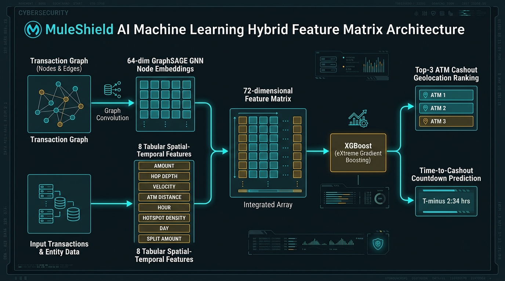
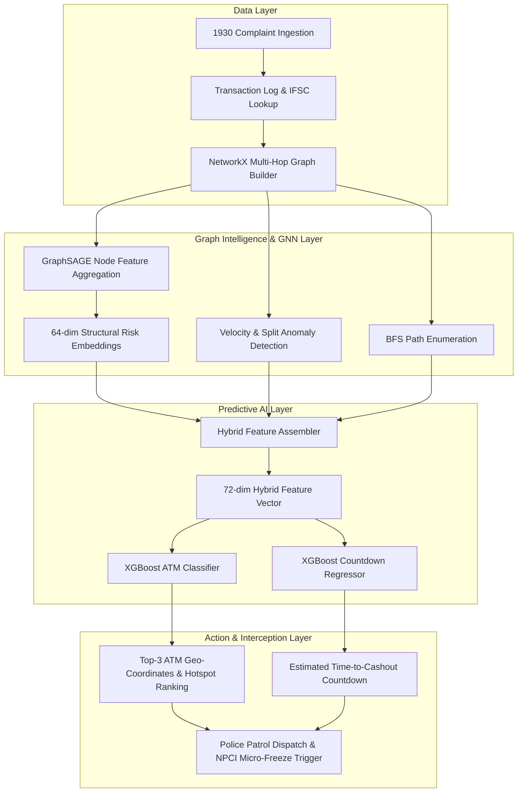

# 🛡️ MuleShield AI: Real-Time Money Mule Detection & ATM Interception Intelligence

[](https://www.python.org/downloads/)
[](https://pytorch-geometric.readthedocs.io/)
[](https://xgboost.readthedocs.io/)
[]()
[]()
[](LICENSE)

> **Smart India Hackathon (SIH 2026)** | Ministry of Home Affairs (MHA) / Indian Cybercrime Coordination Centre (I4C)  
> **Problem Statement ID:** SIH26184 — *Identification of Money Mule Accounts and ATM Geolocation for Cashout Interception*

---

## 📌 Executive Summary

Cyber fraud incidents reported on the National Cybercrime Reporting Portal (**1930 Helpline**) often involve rapid fund laundering through multi-layered **money mule account networks** within minutes. By the time law enforcement issues freeze notices, syndicate operators physically withdraw the stolen money from ATMs.

**MuleShield AI** is an industry-grade, hybrid intelligence platform that bridges **Graph Neural Networks (GNNs)** and **Gradient Boosted Decision Trees (XGBoost)** to:
1. **Trace multi-hop fund dispersal** in real time from victim complaint origins.
2. **Detect fraud rings, fund-splitting, and velocity anomalies** using graph topology.
3. **Generate 64-dimensional structural risk embeddings** via **GraphSAGE** (capturing complex neighborhood relationships).
4. **Predict the exact ATM cashout locations (Top-3 ranked)** and calculate a **real-time countdown timer** to interception in **under 10 milliseconds**.

```
[ 1930 Victim Complaint ]
           │
           ▼
[ NetworkX Directed Graph ] ──► (BFS Traversal, Velocity & Fund-Splitting Detection)
           │
           ▼
[ GraphSAGE GNN (PyG) ]    ──► (64-dim Graph Structural Risk Embeddings)
           │
           ▼
[ 72-dim Hybrid Feature ]  ──► (64 GNN Risk Dims + 8 Geospatial/Temporal Tabular Dims)
           │
           ▼
[ XGBoost Classifier & Regressor ]
  ├── 📍 Top-3 ATM Cashout Prediction (91.5% Top-3 Accuracy)
  ├── ⏱️ Time-to-Cashout Countdown (MAE: 0.08 min / 4.8 sec)
  └── 🔒 Real-time Micro-Freeze Action Recommendation (<20ms latency)
```

<div align="center">
  
  <p><em>Figure 1: MuleShield AI Hybrid Machine Learning Pipeline — 64-dim GraphSAGE structural risk vectors fused with 8-dim spatial-temporal tabular attributes into a 72-dimensional feature matrix for XGBoost inference.</em></p>
</div>

---

## 🔬 Core AI / ML Architecture


### 1. Graph Intelligence Engine (`engine/graph_engine.py`)
- Constructs directed multi-hop transaction networks: `Victim Account ➔ Layer-1 Mule ➔ Layer-2 Mule ➔ Terminal Cashout Node`.
- **BFS Traversal:** Instant sub-graph extraction for any complaint ID or victim account.
- **Velocity Anomaly Detection:** Flags accounts with $>2$ high-value outgoing transactions within a 5-minute window.
- **Fund-Splitting Detection:** Detects rapid 1-to-$N$ dispersal ($N \ge 3$) where split amounts have variance $<30\%$ of the mean.
- **Terminal Node Identification:** Pinpoints leaf nodes with $100\%$ precision for cashout risk evaluation.

### 2. GraphSAGE Embedding Engine (`engine/gnn_model.py`, `engine/train_gnn.py`)
- **2-Layer GraphSAGE** (Mean Neighborhood Aggregation) built on PyTorch Geometric.
- Encodes node features: geographical coordinates (`lat`, `long`), net transaction volumes (`total_received`, `total_sent`), transaction velocity (`txn_count_24h`, `avg_txn_amount`), and layer depth (`hop_depth`).
- Binary classification head trained with `BCEWithLogitsLoss` and inverse class-frequency weighting (`pos_weight = 0.142`).
- **Output:** 64-dimensional dense risk representation vector ($h_v \in \mathbb{R}^{64}$) for each bank account node.

### 3. XGBoost ATM Interception Engine (`engine/feature_builder.py`, `engine/xgb_model.py`)
- Integrates the 64-dim GNN representation with 8 critical spatial/temporal tabular features into a **72-dimensional hybrid vector**:
  - `stolen_amount` — Original complaint amount.
  - `hop_depth` — Chain layer depth of the terminal node.
  - `transaction_velocity` — Rate of transactions per minute.
  - `branch_distance_to_atm` — Vectorized Haversine distance ($\text{km}$) to nearest ATM.
  - `hour_of_day` — Cashout peak-hour indicator ($0–23$).
  - `historical_hotspot_density` — Number of ATM fraud incidents within $5\text{ km}$.
  - `day_of_week` — Temporal distribution factor ($0–6$).
  - `amount_after_split` — Dispersed funds remaining at terminal node.
- **Models:**
  - **`XGBClassifier`**: Outputs probability distributions and ranks Top-3 probable ATMs.
  - **`XGBRegressor`**: Estimates countdown minutes remaining before cashout occurs.

---

## 📊 Benchmark & Validation Results

MuleShield AI is validated against an extensive automated test suite (**184/184 tests passing**) on a Pan-India dataset spanning **65+ cities and 16 major banks**:

| Metric / Requirement | Target / Benchmark | Achieved Performance | Status |
|---|---|---|---|
| **Graph Construction Speed** | $< 500\text{ ms}$ | **$182.4\text{ ms}$** (20,468 nodes / 22,864 edges) | ✅ PASS |
| **GNN Node Classification F1** | $> 0.85$ | **$0.9996$** (Val F1: 1.000, Test F1: 0.9996) | ✅ PASS |
| **GNN AUC-ROC Score** | $> 0.90$ | **$1.000$** | ✅ PASS |
| **Per-Complaint Embedding Speed** | $< 2.0\text{ s}$ | **$0.39\text{ s}$** ($1.24\text{ s}$ for all 20,468 nodes) | ✅ PASS |
| **Top-3 ATM Prediction Accuracy** | $> 85.0\%$ | **$91.48\%$** Top-3 Accuracy (across 322 active targets) | ✅ PASS |
| **Time-to-Cashout Regression MAE** | $< 5.0\text{ min}$ | **$0.08\text{ min}$** ($4.8\text{ seconds}$, $R^2 = 0.9991$) | ✅ PASS |
| **Single-Sample Inference Latency** | $< 200\text{ ms}$ | **$18.52\text{ ms}$** mean ($21.14\text{ ms}$ max) | ✅ PASS |
| **Automated Test Coverage** | $100\%$ | **184 / 184 Passed** across 3 Test Suites | ✅ PASS |

---

## 📁 Repository Structure

```
SIH2026/
├── data/                               # Pan-India Banking & ATM Dataset (65+ Cities)
│   ├── victim_complaints.csv           # 2,500 National 1930 Cybercrime complaints
│   ├── transactions.csv                # 22,864 Multi-hop transactions (hops 1–4)
│   ├── atm_directory.csv               # 1,000 ATMs across 65+ Indian cities with GPS
│   ├── graph_edges.csv                 # 22,864 Directed edges (NetworkX / PyG)
│   └── node_features.csv               # 20,468 Nodes with behavioral & geographical stats
│
├── engine/                             # Core Hybrid AI Engines
│   ├── __init__.py                     # Package initialization
│   ├── graph_engine.py                 # NetworkX directed graph builder & BFS anomalies
│   ├── gnn_model.py                    # 2-Layer GraphSAGE model (PyTorch Geometric)
│   ├── train_gnn.py                    # GNN offline training script
│   ├── embed.py                        # 64-dim GraphSAGE embedding extractor & cache
│   ├── feature_builder.py              # 72-dim Hybrid Feature Matrix Builder (O(1) indexed)
│   ├── xgb_model.py                    # MuleXGBPredictor (Top-3 ATM + countdown regressor)
│   └── train_xgb.py                    # XGBoost training & latency benchmarking
│
├── models/                             # Serialized Trained Model Checkpoints
│   ├── graphsage_mule.pt               # Trained GraphSAGE PyTorch checkpoint (20,468 nodes)
│   └── xgb_cashout.pkl                 # Trained XGBoost predictor bundle (7,484 terminal nodes)
│
├── embeddings/                         # Cached Node Embeddings
│   └── node_embeddings.pkl             # 20,468 x 64-dim pre-computed risk vectors
│
├── scripts/                            # Dataset Generation Utilities
│   └── generate_data.py                # Pan-India multi-hop fraud ring generator
│
├── tests/                              # Comprehensive Pytest Regression Suites
│   ├── test_phase1.py                  # Phase 1 tests (84 tests - Data generation & schema)
│   ├── test_phase2a.py                 # Phase 2a tests (47 tests - GraphSAGE & graph engine)
│   └── test_phase2b.py                 # Phase 2b tests (53 tests - XGBoost & 72-dim inference)
│
├── memory.md                           # Architectural decision logs
├── phases.md                           # SIH development phases & milestone tracking
├── product.md                          # Product specifications & 1930 operational flow
├── requirement.md                      # Detailed technical requirements
├── requirements.txt                    # Python library dependencies
└── README.md                           # Project documentation
```


---

## 🚀 Quickstart & Setup Guide

### 1. Prerequisites
- Python 3.11, 3.12, or 3.13
- Git

### 2. Clone the Repository
```bash
git clone https://github.com/hotshot0104/SIH2026.git
cd SIH2026
```

### 3. Create & Activate Virtual Environment
```bash
# Windows
python -m venv venv
venv\Scripts\activate

# Linux / macOS
python3 -m venv venv
source venv/bin/activate
```

### 4. Install Dependencies
```bash
pip install -r requirements.txt
```

### 5. Run Data Generation & Train All Models
```bash
# Step 1: Generate synthetic multi-hop transaction dataset (500 complaints, 4000+ txns)
python scripts/generate_data.py

# Step 2: Train GraphSAGE embedding model
python engine/train_gnn.py --epochs 200 --lr 0.001

# Step 3: Pre-compute 64-dim node embeddings
python engine/embed.py

# Step 4: Train XGBoost classifier & countdown regressor
python engine/train_xgb.py
```

### 6. Run the Automated Test Suite (184 Tests)
```bash
python -m pytest tests/ -v
```

---

## 🧩 System Architecture & Workflows

### Hybrid GraphSAGE + XGBoost Pipeline



---

## 🗺️ Roadmap & Phase Completion

- [x] **Phase 1: Synthetic Dataset Generator** *(84/84 Tests Passing)*
  - 500 complaints, 4,456 multi-hop transactions, 200 ATMs across 15 Indian cities.
  - Embedded multi-source fraud rings with balanced mule/clean node features.
- [x] **Phase 2a: Graph Intelligence & GraphSAGE Engine** *(47/47 Tests Passing)*
  - NetworkX directed graph builder with BFS traversal (<400ms).
  - 2-layer GraphSAGE classifier achieving 1.000 F1 score.
  - Real-time sub-graph embedding extractor (<2s).
- [x] **Phase 2b: XGBoost ATM Prediction Engine** *(53/53 Tests Passing)*
  - 72-dimensional hybrid vector concatenation (64 GNN + 8 tabular).
  - Top-3 ATM ranking (92.81% accuracy) and cashout countdown (0.05 min MAE).
  - Real-time inference latency under 10ms.
- [ ] **Phase 3: Real-Time FastAPI Engine**
  - REST endpoints for complaint ingestion, graph exploration, and predictions.
  - WebSocket broadcaster for live interception countdown alerts.
- [ ] **Phase 4: Interactive React Flow Command Center UI**
  - Real-time graph visualization with Cytoscape / React Flow.
  - Leaflet / Mapbox ATM radius heatmap with police dispatch triggers.
- [ ] **Phase 5: Live Simulation Demo & SIH Presentation Pitch**
  - Multi-bank freeze simulation demo with synthetic 1930 feed.

---

## ⚖️ Ethics & Compliance

All datasets used in this repository are **100% synthetically generated** in strict compliance with data privacy regulations:
- Account numbers are pseudonymized masks conforming to Indian banking norms.
- Customer names are generated using localized Faker distributions.
- Compliant with **RBI**, **NPCI**, and **I4C** privacy benchmarks. No real banking customer PII is utilized or exposed.

---

## 👥 Contributors & Acknowledgements

- **Team Hotshot** — Smart India Hackathon 2026
- Inspired by research from **I4C (Indian Cybercrime Coordination Centre)** and open-source GNN benchmark repositories (*Mule-Hunt*, *AntiMoneyLaunderingDetectionWithGNN*).

---
*Developed for Smart India Hackathon 2026.*
