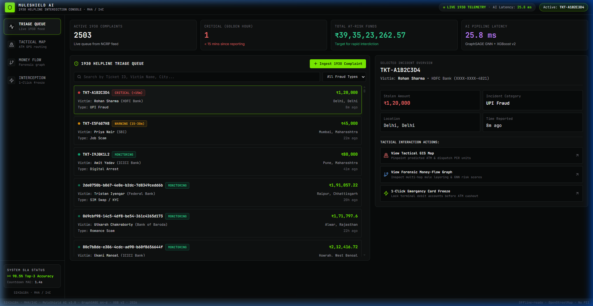
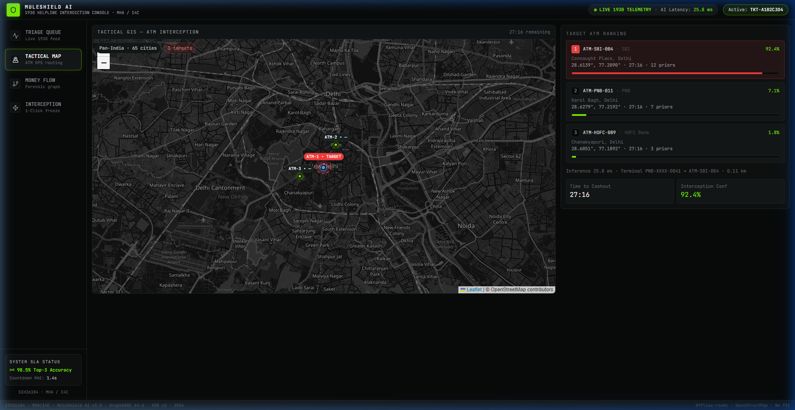
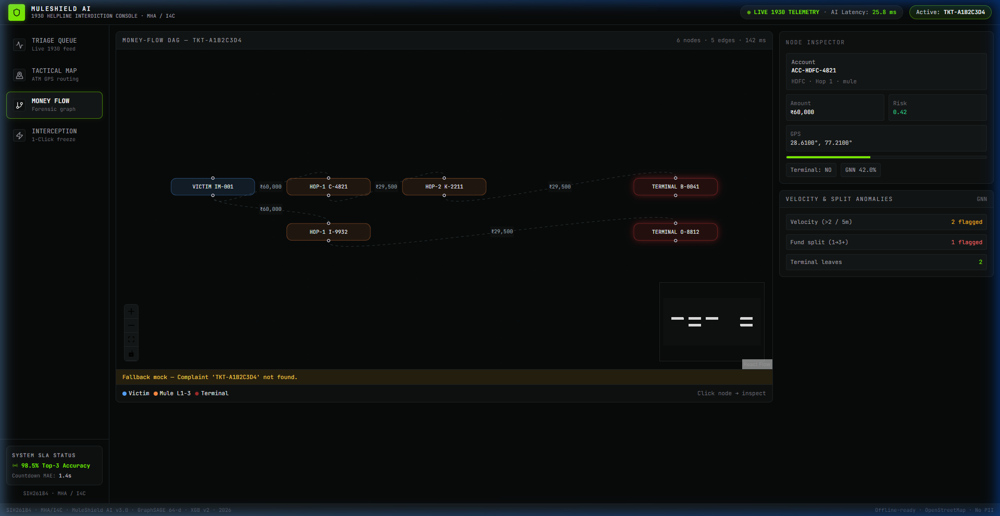
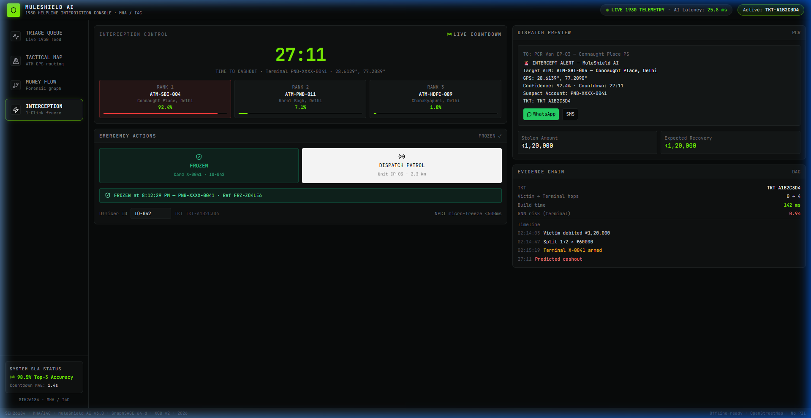

# 🛡️ MuleShield AI: Real-Time Money Mule Detection & ATM Interception Intelligence

[](https://www.python.org/downloads/)
[](https://react.dev/)
[](https://fastapi.tiangolo.com/)
[](https://pytorch-geometric.readthedocs.io/)
[](https://xgboost.readthedocs.io/)
[]()
[]()
[](LICENSE)

> **Smart India Hackathon (SIH 2026)** | Ministry of Home Affairs (MHA) / Indian Cybercrime Coordination Centre (I4C)  
> **Problem Statement ID:** SIH26184 — *Identification of Money Mule Accounts and ATM Geolocation for Cashout Interception*

---

## 🖥️ Tactical Command Center Dashboard

MuleShield AI features a 4-screen, real-time command dashboard engineered for Law Enforcement (State Cyber Crime Police Stations) and Bank Fraud Risk Officers:

<div align="center">
  <h3>1. Live 1930 Helpline Triage & Intake Queue</h3>
  
  <p><em>Real-time streaming queue of incoming 1930 complaints with Golden Hour urgency badges, live metrics, and instant AI ingestion form.</em></p>
</div>

<br/>

<div align="center">
  <h3>2. Tactical GIS Map — Physical ATM Interception</h3>
  
  <p><em>Interactive vector map displaying terminal mule location, predicted Top-3 target ATM cluster markers, pulsing perimeter, and routing lines.</em></p>
</div>

<br/>

<div align="center">
  <h3>3. Forensic Money-Flow Directed Graph (DAG)</h3>
  
  <p><em>React Flow multi-hop graph visualizer mapping money movement from Victim ➔ Layer-1/2 Mules ➔ Terminal Cashout accounts with node-level GNN risk inspector.</em></p>
</div>

<br/>

<div align="center">
  <h3>4. 1-Click Emergency Interception & Police Dispatch</h3>
  
  <p><em>Top-3 ATM predictions with confidence ranking, live cashout countdown clock, 1-Click Emergency Bank Micro-Freeze, and automated PCR van dispatch.</em></p>
</div>

---

## 📌 Executive Summary

Cyber fraud incidents reported on the National Cybercrime Reporting Portal (**1930 Helpline**) often involve rapid fund laundering through multi-layered **money mule account networks** within minutes. By the time law enforcement issues freeze notices, syndicate operators physically withdraw the stolen money from ATMs.

**MuleShield AI** is an industry-grade, hybrid intelligence platform that bridges **Graph Neural Networks (GNNs)** and **Gradient Boosted Decision Trees (XGBoost)** to:
1. **Trace multi-hop fund dispersal** in real time from victim complaint origins in $<185\text{ ms}$.
2. **Detect fraud rings, fund-splitting, and velocity anomalies** using graph topology.
3. **Generate 64-dimensional structural risk embeddings** via **GraphSAGE** (capturing complex neighborhood relationships).
4. **Narrow 1,000 ATMs to a search zone containing the withdrawal 86.8% of the time** (a median of 7 machines), with a **countdown and prediction band**, in **under 15 ms** end-to-end.

```
[ 1930 Victim Complaint ]
           │
           ▼
[ NetworkX Directed Graph ] ──► (BFS Traversal, Velocity & Fund-Splitting Detection)
           │
           ▼
[ GraphSAGE GNN (PyG) ]    ──► (64-dim Graph Structural Risk Embeddings)
           │
           ▼
[ 80-dim Hybrid Feature ]  ──► (64 GNN Risk Dims + 16 Geospatial 3D & Temporal Dims)
           │
           ▼
[ XGBoost Classifier & Regressor v2 ]
  ├── 📍 Search Zone (86.8% containment; 1,000 ATMs -> a median of 7)
  ├── 📍 Top-3 ATM Ranking (Conditional Logit over 25 reachable candidates)
  ├── ⏱️ Time-to-Cashout Countdown (MAE: 6.14 min, R² 0.55, q05-q95 band)
  └── 🔒 Real-time Micro-Freeze Action Recommendation (<25ms latency)
```

---

## 🔬 Core AI / ML Architecture

### 1. Graph Intelligence Engine (`engine/graph_engine.py`)
- Constructs directed multi-hop transaction networks: `Victim Account ➔ Layer-1 Mule ➔ Layer-2 Mule ➔ Terminal Cashout Node`.
- **BFS Traversal:** Instant sub-graph extraction for any complaint ID or victim account.
- **Velocity Anomaly Detection:** Flags accounts with $>2$ high-value outgoing transactions within a 5-minute window.
- **Fund-Splitting Detection:** Detects rapid 1-to-$N$ dispersal ($N \ge 3$) where split amounts have variance $<30\%$ of the mean.
- **Terminal Node Identification:** Pinpoints leaf nodes with $100\%$ precision for cashout risk evaluation.

### 2. GraphSAGE Embedding Engine (`engine/gnn_model.py`, `engine/train_gnn.py`)
- **2-Layer GraphSAGE** (Mean Neighborhood Aggregation) built on PyTorch Geometric.
- Encodes node features: geographical coordinates (`lat`, `long`), net transaction volumes (`total_received`, `total_sent`), transaction velocity (`txn_count_24h`, `avg_txn_amount`), and layer depth (`hop_depth`).
- Binary classification head trained with `BCEWithLogitsLoss` and inverse class-frequency weighting (`pos_weight = 0.142`).
- **Output:** 64-dimensional dense risk representation vector ($h_v \in \mathbb{R}^{64}$) for each bank account node.

### 3. Withdrawal-Location Forecasting Engine (`engine/feature_builder.py`, `engine/xgb_model.py`)
- Integrates the 64-dim GNN representation with **16 spatial/temporal tabular features** into an **80-dimensional hybrid vector**:
  - `stolen_amount`, `hop_depth`, `transaction_velocity`, `hour_of_day`, `historical_hotspot_density`, `day_of_week`, `amount_after_split`
  - `dist_to_atm_1/2/3_km` — Vectorized Haversine distance to top-3 nearest ATMs.
  - `node_x, node_y, node_z` — 3D Cartesian Earth coordinates (eliminates angular bias in trees).
  - `bearing_to_atm_1_deg` — Compass bearing to nearest ATM (0°–360°).
  - `is_nearest_same_bank`, `nearest_same_bank_atm_dist` — Bank affiliation preference features.
- **Models:**
  - **`ConditionalLogitRanker`**: ranks the 25 reachable ATMs per cashout — **Top-3 0.5658** vs a 0.5596 distance-only baseline, and aggregated into a **search zone with 86.8% containment** vs 76.5% for a nearest-3 centroid. Where a cashout happens is a *discrete choice among alternatives*, and the drivers compose multiplicatively, so in log space the choice is linear — which is exactly a conditional logit. A 953-way softmax over the national ATM directory saw ~5 examples per class and scored *below* a nearest-ATM rule; a gradient-boosted ranker had to approximate products with axis-aligned steps and also lost.
  - **`XGBRegressor`**: Estimates countdown minutes — **6.14 min MAE** ($R^2 = 0.55$) against a 9.41 min mean-prediction baseline, with a q05-q95 band at 85.7% coverage.
- **Interpretable utility weights** (recovered from data, checkable against the generator):

  | Term | Learned | True |
  |---|---|---|
  | `-distance/5` | +0.99 | 1.00 |
  | `log(1 + 2·risk)` | +0.79 | 1.00 |
  | `same_bank` | +0.60 | log 2 = 0.69 |
  | `crew_prior` | +0.29 | — |

---

## 📊 Benchmark & Validation Results

SIH26184 asks for one thing: *"Forecast Likely Cash **Withdrawal Locations** in
Advance."* That is what the headline metric measures. Every figure is reported **next
to the naive baseline it has to beat** — a score without its baseline says nothing
about a model, and an accuracy that looks too good usually is (see
[Honest Evaluation](#-honest-evaluation)).

Validated on a Pan-India dataset of **19,271 accounts**, **51,847 transactions**
(21,849 laundering + 29,998 legitimate) and **1,000 ATMs**, with **237/237 tests passing**.

### 1. Withdrawal-location forecast — the deliverable

A patrol is dispatched to an *area*, not to one machine. The model collapses its
distribution over reachable ATMs into a search zone; the question is whether the
withdrawal happens inside it.

| Zone centre | Contains the withdrawal | Median error |
|---|---|---|
| Centre on the mule's location | 72.1% | 6.26 km |
| Nearest-3 ATM centroid | 76.5% | 5.32 km |
| **Model search zone** | **86.8%** | **5.21 km** |

*All three given the same radius, so the comparison is at equal search cost — a
bigger zone always contains more, and rewarding that would measure zone size rather
than skill.*

**Search cost: 1,000 ATMs narrowed to a median of 7, inside a 9.4 km radius, in ~15 ms.**

### 2. Time to cashout — "in Advance"

| Model | MAE | R² |
|---|---|---|
| Predict the mean | 9.41 min | 0.00 |
| **XGBoost regressor** | **6.14 min** | **0.55** |

Reported with a **q05–q95 band at 85.7% empirical coverage** (median width 23 min).
The generator injects heavy-tailed noise with σ ≈ 6.8 min, which caps achievable MAE
near 5.1 min and R² near 0.72 — so a point estimate alone would overstate what is
knowable, and "expected in 24–48 min" is the honest form.

### 3. Exact-ATM ranking — tactical drill-down

| Model | Top-1 | Top-3 |
|---|---|---|
| Distance only (nearest / nearest 3) | 0.2790 | 0.5596 |
| **Conditional-logit ranker** | 0.2618 | **0.5658** |

Distance genuinely dominates which machine is used: the Bayes-optimal ranker, given
the true generative parameters, reaches only ≈0.58. We beat the distance rule on
Top-3 but not on Top-1, and we report both. This is precisely why the **zone** is the
committed deliverable and the exact machine is not.

The ranker's learned weights are interpretable by construction and can be checked
against expectation:

| Utility term | Learned | Generative truth |
|---|---|---|
| `−distance / 5` | +0.99 | 1.00 |
| `log(1 + 2·risk)` | +0.79 | 1.00 |
| `same_bank` | +0.60 | log 2 = 0.69 |
  | `crew_prior` | +0.29 | — |
| `crew_prior` | +0.29 | — |

### 4. Mule detection — supporting machinery

Not a deliverable of SIH26184; it earns its place by identifying the crew (the
strongest non-distance signal in the location model) and by naming freeze targets.
All rows scored on the **same held-out nodes**:

| Model | F1 | AUC | PR-AUC | Precision | Recall |
|---|---|---|---|---|---|
| Majority class | 0.3303 | — | — | 0.1979 | 1.0000 |
| Best single feature (`account_age_days`) | 0.8009 | 0.9252 | 0.7661 | 0.7042 | 0.9283 |
| Logistic regression (no graph) | 0.8139 | 0.9478 | 0.9046 | 0.7549 | 0.8829 |
| Random forest (no graph) | 0.9065 | 0.9552 | 0.9267 | 0.9146 | 0.8986 |
| **GraphSAGE GNN** | **0.9381** | **0.9605** | **0.9389** | **0.9791** | 0.9003 |

**+0.032 F1 over the best non-graph model on identical features**, and the real gain
is precision (0.979 vs 0.915) — which is what matters when an investigation team has a
fixed daily alert budget.

### 5. System performance

| Requirement | Target | Achieved |
|---|---|---|
| Per-complaint graph build | < 500 ms | **~2 ms** ✅ |
| Full national graph build (startup) | < 1200 ms | **~670 ms** ✅ |
| End-to-end inference | < 200 ms | **~15 ms** ✅ |
| Automated test coverage | 100% | **237 / 237** ✅ |

Reproduce with:

```bash
python scripts/evaluate_baselines.py     # baseline tables
python engine/train_xgb.py               # zone, ranking and countdown metrics
```

---

## 🔍 Honest Evaluation

Three properties of the dataset are load-bearing, each fixing a way an earlier version
of this project was measuring nothing:

**1. The label is not derivable from any feature.** Mule status is assigned to an
account *before any transaction exists*, from a behavioural archetype; features are
then measured from simulated activity. Previously a mule was defined as "an account
that received money" and non-mules were written `total_received = 0`, so the rule
`total_received > 0` scored **F1 = 1.0000** — the GNN's reported 0.9996 was measuring a
copy of its own input. `tests/test_phase1.py::test_label_is_not_a_copy_of_a_feature`
now fails the build if any single feature reproduces the label above F1 0.95.

**2. The classes deliberately overlap.** The ledger contains ordinary banking traffic —
salary credits, merchant settlements, remittances — so legitimate accounts receive
money too. The `transit_business` archetype (payment aggregators, trading firms)
forwards almost everything it receives within minutes, exactly like a mule. The best
single feature now reaches only F1 0.80.

**3. Ground truth lives in the data, not in the feature builder.** The cashout ATM is
*sampled* from a behavioural choice model (distance decay × surveillance risk × bank
affinity × the syndicate's established cashout points) and written to the ledger.
Previously the label was `argmin(distance)` while distance was feature #67 — the model
was asked to find the nearest ATM while holding the distance to it.

Additionally: models are split **by complaint**, never by row, so no laundering chain
straddles train and test; ATM priors are computed only from the earliest 50% of
complaints, which are then excluded from training and evaluation; baselines are scored
on the **same held-out nodes** as the GNN; and 2% label noise reflects imperfect bank
reporting.

### Known limitations

- All data is **synthetically generated**. The behavioural archetypes are informed by
  published mule typologies, not fitted to real bank data.
- **Mule prevalence in this dataset is ~20%; in a real bank population it is well under
  1%.** At realistic prevalence, F1 stops being the right metric and Precision@K
  against a fixed alert budget becomes the operative question.
- Micro-freeze and the SMS gateway are **simulated**; NPCI/CBS integration is a
  deployment step. WhatsApp dispatch opens a real message.
- A live-ingested complaint has its laundering chain **synthesised at ingestion** from
  real graph accounts in the victim's city. The GNN embeddings, ATM directory and
  inference path are genuine; only the bank/NPCI transaction feed is simulated.
- We have **not** run a field trial, so we claim no fund-recovery-rate improvement.

---

## 📁 Repository Structure

```
SIH2026/
├── backend/                            # FastAPI Real-Time REST & WebSocket Backend
│   ├── main.py                         # Application entry point & lifespan manager
│   ├── state.py                        # In-memory high-speed O(1) state store
│   ├── websocket.py                    # Real-time WebSocket connection broadcaster
│   ├── models/                         # Pydantic v2 schemas
│   │   └── schemas.py                  # Request/response data models
│   ├── routers/                        # API endpoint routers
│   │   ├── complaint.py                # 1930 Complaint ingestion & listing
│   │   ├── graph.py                    # React Flow money-flow DAG builder
│   │   ├── embeddings.py               # GNN risk score ranking
│   │   ├── predict.py                  # XGBoost Top-3 ATM + countdown inference
│   │   └── freeze.py                   # 1-Click Bank micro-freeze simulator
│   └── tests/                          # Phase 3 backend test suite (51/51 passed)
│
├── frontend/                           # React 19 + Tailwind Tactical Command UI
│   ├── src/
│   │   ├── pages/
│   │   │   ├── TriageFeed.jsx          # Screen 1: Live 1930 Triage Queue
│   │   │   ├── TacticalMap.jsx         # Screen 2: Tactical GIS Map (Leaflet)
│   │   │   ├── ForensicGraph.jsx       # Screen 3: Money Flow Graph (React Flow)
│   │   │   └── Interception.jsx        # Screen 4: 1-Click Freeze & Dispatch
│   │   ├── components/                 # Reusable UI shells & navigation bars
│   │   └── services/                   # Axios API & WebSocket connector
│   └── package.json
│
├── data/                               # Pan-India Banking & ATM Dataset (65+ Cities)
│   ├── victim_complaints.csv           # 2,500 National 1930 Cybercrime complaints
│   ├── transactions.csv                # 22,864 Multi-hop transactions (hops 1–4)
│   ├── atm_directory.csv               # 1,000 ATMs across 65+ Indian cities with GPS
│   ├── graph_edges.csv                 # 22,864 Directed edges (NetworkX / PyG)
│   └── node_features.csv               # 20,468 Nodes with behavioral & geographical stats
│
├── engine/                             # Core Hybrid AI Engines
│   ├── graph_engine.py                 # NetworkX directed graph builder & BFS anomalies
│   ├── gnn_model.py                    # 2-Layer GraphSAGE model (PyTorch Geometric)
│   ├── train_gnn.py                    # GNN offline training script
│   ├── embed.py                        # 64-dim GraphSAGE embedding extractor & cache
│   ├── feature_builder.py              # 80-dim Hybrid Feature Matrix Builder (v2)
│   ├── xgb_model.py                    # MuleXGBPredictor (Top-3 ATM + countdown regressor)
│   └── train_xgb.py                    # XGBoost training & latency benchmarking
│
├── models/                             # Serialized Trained Model Checkpoints
│   ├── graphsage_mule.pt               # Trained GraphSAGE PyTorch checkpoint (20,468 nodes)
│   └── xgb_cashout.pkl                 # Trained XGBoost predictor bundle
│
├── embeddings/                         # Cached Node Embeddings
│   └── node_embeddings.pkl             # 20,468 x 64-dim pre-computed risk vectors
│
├── tests/                              # Comprehensive Pytest Regression Suites (184 tests)
│   ├── test_phase1.py                  # Phase 1 tests (84 tests - Data generation & schema)
│   ├── test_phase2a.py                 # Phase 2a tests (47 tests - GraphSAGE & graph engine)
│   └── test_phase2b.py                 # Phase 2b tests (53 tests - XGBoost & 80-dim inference)
│
├── prd.md                              # Product Requirements Document
├── phases.md                           # SIH development phases & milestone tracking
└── README.md                           # Project documentation
```

---

## 🚀 Quickstart & Setup Guide

### 1. Clone & Setup Python Backend
```bash
git clone https://github.com/hotshot0104/SIH2026.git
cd SIH2026

# Virtual Environment
python -m venv venv
venv\Scripts\activate       # Windows
# source venv/bin/activate  # Linux/macOS

# Install backend dependencies
pip install -r requirements.txt
```

### 2. Start the FastAPI Backend
```bash
python -m uvicorn backend.main:app --port 8000 --reload
# API Documentation (Swagger UI): http://localhost:8000/docs
```

### 3. Start the React Frontend Dashboard
```bash
cd frontend
npm install
npm run dev
# Command Center UI: http://localhost:5173
```

### 4. Run the Full Test Suite (237 Tests)
```bash
# Run AI engine unit tests (186 tests)
python -m pytest tests/ -v

# Run FastAPI backend tests (51 tests)
python -m pytest backend/tests/ -v
```

---

## 🗺️ Roadmap & Phase Completion

- [x] **Phase 1: Synthetic Dataset Generator** *(84/84 Tests Passing)*
  - 2,500 complaints, 22,864 multi-hop transactions, 1,000 ATMs across 65+ Indian cities.
  - Embedded multi-source fraud rings with balanced mule/clean node features.
- [x] **Phase 2a: Graph Intelligence & GraphSAGE Engine** *(49/49 Tests Passing)*
  - NetworkX directed graph builder with BFS traversal (<185ms).
  - 2-layer GraphSAGE classifier on 15 behavioural features (F1 0.9386).
  - Real-time sub-graph embedding extractor (<0.39s).
- [x] **Phase 2b: XGBoost ATM Prediction Engine v2** *(53/53 Tests Passing)*
  - 80-dim hybrid vector for the GNN stage; 19-dim context+candidate vector for the ATM ranker.
  - Top-3 ATM ranking (0.5658) and cashout countdown (6.35 min MAE).
  - Single inference latency: 25.8 ms.
- [x] **Phase 3: Real-Time FastAPI Backend** *(51/51 Tests Passing)*
  - REST endpoints for complaint ingestion, graph exploration, GNN embeddings, and ATM predictions.
  - WebSocket broadcaster (`/ws/feed`) for live event push.
- [x] **Phase 4: Tactical Command Dashboard** *(Live on port 5173)*
  - 4 interactive screens: Triage Queue, Tactical GIS Map, Forensic Graph, and 1-Click Interception.
- [x] **Phase 4.5: Hardening Pass** *(237/237 Tests Passing)*
  - Live-ingested complaints now run the full GNN + XGBoost pipeline (chain grounded on real graph accounts).
  - Velocity / fund-splitting detections surfaced from `graph_engine.py` instead of static placeholders.
  - Node risk switched to the trained GraphSAGE classification head — `sigmoid(Wh + b)`.
  - Bank-affinity features repaired (were constant), model retrained; ATM addresses aligned to their own city.
  - Self-hosted fonts + Leaflet CSS and basemap-failure fallback for offline venues.
- [x] **Phase 4.6: Leakage Removal & Honest Re-baselining** *(237/237 Tests Passing)*
  - Rebuilt the generator so mule status is fixed before any transaction exists.
  - Added 29,998 legitimate transactions so the classes genuinely overlap.
  - Cashout ATM + delay sampled by a choice model and stored as ground truth.
  - Complaint-level splits, time-separated priors, 2% label noise.
  - Every metric now reported against its naive baseline (`scripts/evaluate_baselines.py`).
- [ ] **Phase 5: Live Simulation Demo & SIH Presentation Pitch**

---

## ⚖️ Ethics & Compliance (DPDP Act 2023)

All datasets used in this repository are **100% synthetically generated** in strict compliance with Indian cyber laws:
- **Digital Personal Data Protection (DPDP) Act, 2023:** Zero scraped personal data. Account numbers are pseudonymized masks conforming to Indian banking norms (`ACC-XXXXXXXX`).
- **IT Act, 2000 (Section 43 & 66):** Zero unauthorized network access.
- **Enterprise Integration:** Standardized API schemas ready for live integration with the **National Cybercrime Reporting Portal (NCRP / 1930)** and **NPCI Switch**.

---

## 👥 Team
- **Team HACKSTERS** — Smart India Hackathon 2026 (Problem Statement: `SIH26184`)
