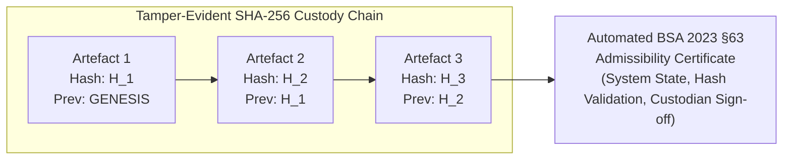

# Forecasting the Physical Exit: A Spatio-Temporal Graph Framework for Proactive Cash-Out Interception in Cybercrime Networks

**Author:** Sameer Kumar Singh  
**Affiliation:** Department of Information Technology, Pranveer Singh Institute of Technology (PSIT), Kanpur, Uttar Pradesh, India  
**Focus Area:** Spatio-Temporal Intelligence & Cybercrime Cash-Out Interception  
**Date:** September 2026  

---

## Abstract

Financial cyber fraud syndicates rapidly channel stolen funds through multi-layered mule accounts before physically withdrawing cash at ATMs. Existing countermeasures—CFCFRMS fund freezing, MuleHunter.AI mule account detection, and Pratibimb retrospective crime mapping—are fundamentally account-centric and reactive: once cash is dispensed, the digital trail terminates and recovery becomes infeasible.

We present **MuleShield AI**, a framework that forecasts *where* and *when* stolen funds will be physically withdrawn. The architecture integrates deterministic BFS fund tracing, inductive GraphSAGE structural embeddings (10,561 parameters), a Nested Logit discrete choice model for ATM selection, and a dual-regime lognormal-Weibull survival kernel for withdrawal countdown estimation. A bounded-prior forward intensity surface (≤15% historical mass) aggregates concurrent cases while preventing predictive policing feedback loops.

Evaluated on a synthetic pan-India benchmark of 49,999 accounts, 622,304 transactions, and 1,000 ATMs, MuleShield AI achieves 87.3% physical search zone containment (median 5.04 km error), outperforming spatial centroids ($p = 3.52 \times 10^{-14}$, McNemar test); a forward surface PAI@5 of 32.67 with 96.37% capital coverage; and a median tactical lead time of 40.2 minutes. End-to-end ML inference executes in 5.2 ms; the full switch integration pipeline completes in 7.5 ms. All evaluation is on synthetic data; real-world validation requires field trials with banking partners.

---

## 1. Introduction

The rapid digitization of retail banking and instant payment infrastructures—exemplified by the Unified Payments Interface (UPI) and Immediate Payment Service (IMPS) in India—has precipitated a systemic shift in cyber-enabled financial crime. In India alone, financial fraud complaints registered on the National Cybercrime Reporting Portal (NCRP) escalated exponentially from 2.62 lakh in 2021 to over 24.02 lakh by 2025. 

Modern fraud syndicates operate through highly coordinated, multi-tiered money mule networks. When a victim is defrauded (e.g., via digital arrest, social engineering, or investment scams), the stolen funds are instantaneously fragmented and routed through Layer-1, Layer-2, and Layer-3 intermediary mule accounts within minutes. The ultimate objective of the syndicate is the **"physical exit"**: converting digital fiat into untraceable paper cash at Automated Teller Machines (ATMs) or through counter withdrawals before law enforcement agencies (LEAs) or financial institutions can interdict the funds.

```
[Defrauded Victim]
       │
       ▼ (Immediate Transfer: UPI/IMPS)
[Layer-1 Mule Account]
       │
       ▼ (Rapid Fragmentation / Fund-Splitting)
[Layer-2 Mule Account]
       │
       ▼ (Layering / Fan-In)
[Terminal Cash-Out Account]
       │
       ▼ (PHYSICAL EXIT: 20–60 Min Window)
[Physical ATM Terminal] ──► Cash Withdrawn (Digital Trail Terminates Permanently)
```

### 1.1 The Operational Gap in Existing Countermeasures

To combat this epidemic, national authorities and regulatory bodies have introduced advanced defensive systems:
1. **The Citizen Financial Cyber Fraud Reporting and Management System (CFCFRMS / 1930 Helpline):** Operated under the Indian Cybercrime Coordination Centre (I4C), Ministry of Home Affairs (MHA), CFCFRMS enables inter-bank communication to freeze stolen funds within the banking rails. Since inception, it has saved over ₹11,158 crore across 32.8 lakh complaints.
2. **Behavioral Account Detectors (MuleHunter.AI):** Developed by the Reserve Bank Innovation Hub (RBIH) and deployed across 23+ commercial banks, MuleHunter.AI identifies mule accounts based on 19 transaction and onboarding behavioral patterns, reporting up to 95% classification accuracy.
3. **National Suspect Registries:** Systems like Samanvaya and the I4C Suspect Registry maintain millions of flagged accounts to block transfers.
4. **Geographical Crime Mapping (Pratibimb):** Maps retrospective crime occurrence to highlight historical hotspots.

**The Failure Mode:** Every existing tool is **account-centric and retrospective**. They are designed to freeze digital accounts or map where fraud has *previously* occurred. However, empirical law enforcement data indicates that once funds reach the terminal account, syndicate runners physically extract currency from ATMs within a 20-to-60-minute window (the "Golden Hour"). The moment paper currency is dispensed:
* The digital audit trail ends.
* Banking freeze orders become legally moot.
* Recovery rates drop to near zero.

Currently, **no production system forecasts which specific physical machines are targeted or when the withdrawal will occur**. Law enforcement agencies are left reacting hours or days after the physical cash has vanished.

### Table 1: Systematic Comparison with State-of-the-Art and Deployed National Systems

| System / Framework | Deployed Scope | Mule Account Detection | Multi-Hop Fund Tracing | Spatial ATM Forecasting | Withdrawal Countdown | Forward Hotspot Surface |
| :--- | :--- | :---: | :---: | :---: | :---: | :---: |
| **MuleHunter.AI** (RBIH/RBI) | 23+ Indian Banks (Canara, PNB, BoB) | **Yes** (19 behavior patterns) | Bank-Internal Only | No (Blind to physical cash) | No | No |
| **CFCFRMS / 1930 Helpline** (I4C/MHA) | National LEA Helpline | Account Freeze Only | Reactive Bank Ledger | No (Trail ends at ATM) | No | No |
| **I4C Suspect Registry / Samanvaya** | National Repository (32L mules) | Blacklist Onboarding | No | No | No | No |
| **Pratibimb** (I4C/MHA) | National Police Dashboard | No | No | Retrospective Heatmap Only | No | Static Historical Density |
| **Academic GNN AML** (DELATOR [5], Elliptic [4]) | Research Literature | **Yes** (Node/Edge Classification) | Graph Classification | No | No | No |
| **MuleShield AI (This Work)** | **Prototype Framework** | **Yes** (**F1 0.9051**, GraphSAGE) | **Yes** (Deterministic BFS) | **Yes** (**87.3% Zone**) | **Yes** (**40.2 min Lead**) | **Yes** (**PAI 32.67**, 6.0× Lift) |

### 1.2 Contributions of this Work

This paper presents the theory, design, empirical evaluation, and operational governance of **MuleShield AI**, engineered to address the critical national challenge of proactive cash-out interdiction. Our primary contributions are:

* **Spatio-Temporal Formulation of Cash-Out Choice:** We formulate terminal ATM selection as a discrete choice problem governed by criminal utility theory (balancing proximity against CCTV surveillance risk, bank affiliation, and syndicate habit) rather than unconstrained spatial regression or tabular classification.
* **Hybrid Structural-Temporal Architecture:** We integrate deterministic graph traversal (BFS) with inductive Graph Neural Networks (GraphSAGE), a Nested Logit choice model (relaxing IIA), and a dual-regime lognormal-Weibull survival kernel ($T > t_{\text{elapsed}}$) that produces dynamic countdown intervals.
* **Bounded-Prior Forward Hotspot Surface:** We construct a nationwide continuous intensity surface over 12-km greedy-leader spatial clusters that aggregates multiple concurrent victim complaints while strictly capping the historical prior at $\le 15\%$ of total mass, mathematically preventing the self-reinforcing feedback loops endemic to predictive policing.
* **Honest Empirical Evaluation:** We evaluate the framework on a synthetic pan-India benchmark of 49,999 accounts and 1,000 ATMs, reporting paired exact McNemar significance tests ($p = 3.52 \times 10^{-14}$), component ablation studies, and simulator oracle bound analysis. We explicitly identify limitations including the synthetic-only evaluation and the modest lift over distance baselines.
* **Base-Rate Sensitivity & Ethical Policy Design:** We confront the base-rate fallacy directly, documenting how precision decays from 88.7% to 2.5% as prevalence shifts from a training corpus (2.96%) to real-world national baseline prevalence (0.01%), and formalize a triple-gate governance policy for ATM-level interdiction.
* **Judicial Admissibility Engine:** We architect a tamper-evident SHA-256 state-chained digital evidence repository satisfying Section 63 of India's Bharatiya Sakshya Adhiniyam (BSA), 2023.

---

## 2. Threat Model & Problem Formulation

### 2.1 Graph Formulation of Mule Networks

Let the financial system be represented as a directed multigraph $G = (V, E, \mathcal{W}, \mathcal{T})$, where:
* $V = \{v_1, v_2, \dots, v_N\}$ is the set of bank account nodes.
* $E \subseteq V \times V$ is the set of directed transaction edges.
* $\mathcal{W}: E \to \mathbb{R}^+$ denotes transaction volume (in Indian Rupees, ₹).
* $\mathcal{T}: E \to \mathbb{R}^+$ denotes transaction timestamp.

Each account node $v \in V$ is associated with static attributes $x_v^{\text{static}}$ (e.g., KYC risk score, branch geolocation $\ell_v = (\text{lat}_v, \text{lon}_v)$, account age) and dynamic behavioral attributes $x_v^{\text{dyn}}$ (e.g., velocity in past 24 hours, fan-in/fan-out ratios, burst outbound frequency).

When a victim $v_{\text{victim}}$ files a complaint $C$ at timestamp $t_{\text{complaint}}$ with stolen amount $A_{\text{stolen}}$, our objective is to extract the active downstream laundering DAG $G_C \subset G$.

**Definition 1 (Terminal Cash-Out Account):** A node $v^* \in G_C$ is designated as a terminal cash-out account if it satisfies:
$$\text{out\_degree}_{G_C}(v^*) = 0 \quad \text{and} \quad \sum_{(u, v^*) \in E_{G_C}} \mathcal{W}(u, v^*) \ge \theta_{\text{min}} \cdot A_{\text{stolen}}$$
where $\theta_{\text{min}} \in (0, 1]$ represents the minimum threshold of fund aggregation reaching node $v^*$ after accounting for syndicate transit commissions.

### 2.2 Spatial Formulation: Discrete Choice & Nested Logit (IIA Relaxation)

Let $\mathcal{A} = \{a_1, a_2, \dots, a_M\}$ denote the universe of physical cash dispensing terminals (ATMs), with geolocations $\ell_j = (\text{lat}_j, \text{lon}_j)$, bank affiliation $B_j$, and historical risk score $\rho_j$. For terminal account $v^*$ with geolocation $\ell_{v^*}$ and bank $B_{v^*}$, let $\mathcal{A}(v^*) \subset \mathcal{A}$ be the reachable candidate set ($J = 25$ nearest machines).

Under Random Utility Maximization (RUM), the latent utility $U_{ij}$ for candidate $j \in \mathcal{A}(v^*)$ decomposes into systematic utility $V_{ij}$ and stochastic disturbance $\epsilon_{ij}$:
$$U_{ij} = V_{ij} + \epsilon_{ij}$$

In standard Conditional Multinomial Logit, $\epsilon_{ij} \overset{\text{iid}}{\sim} \text{Gumbel}(0, 1)$, imposing the **Independence of Irrelevant Alternatives (IIA)**: the ratio $P(a_j \mid v^*) / P(a_k \mid v^*)$ remains invariant to other alternatives in $\mathcal{A}(v^*)$. In retail banking, this assumption is violated when candidate ATMs reside in dense spatial clusters (e.g., co-located kiosks in an off-site e-lobby or commercial market), inducing cross-alternative unobserved error correlations.

To relax IIA, we formulate a **Nested Logit (NL)** specification. The candidate set $\mathcal{A}(v^*)$ is partitioned into $M$ disjoint spatial nests $\mathcal{B}_1, \dots, \mathcal{B}_M$ based on spatial proximity and terminal typology (on-premise branch kiosks, commercial transit hubs, and standalone White-Label ATMs). Utility decomposes as $U_{imj} = W_{im} + Y_{ij} + \epsilon_{imj}$, where $(\epsilon_{im1}, \dots, \epsilon_{imJ_m})$ follows a Generalized Extreme Value (GEV) distribution with dissimilarity parameter $\lambda_m \in (0, 1]$. The choice probability factorizes as:
$$P(a_j \mid v^*) = P(\mathcal{B}_m \mid v^*) \cdot P(a_j \mid \mathcal{B}_m, v^*)$$
where conditional terminal choice within nest $\mathcal{B}_m$ and marginal nest choice are given by:
$$P(a_j \mid \mathcal{B}_m, v^*) = \frac{\exp\left( Y_{ij} / \lambda_m \right)}{\sum_{k \in \mathcal{B}_m} \exp\left( Y_{ik} / \lambda_m \right)}$$
$$P(\mathcal{B}_m \mid v^*) = \frac{\exp\left( W_{im} + \lambda_m I_{im} \right)}{\sum_{l=1}^M \exp\left( W_{il} + \lambda_l I_{il} \right)}$$
Here, $I_{im} = \ln \left( \sum_{k \in \mathcal{B}_m} \exp(Y_{ik} / \lambda_m) \right)$ represents the inclusive value (log-sum) of nest $m$. Terminal systematic utility combines spatial friction, bank affinity, crew priors, and the GraphSAGE bilateral interaction term:
$$Y_{ij} = \beta_1 \left(-\frac{d(\ell_{v^*}, \ell_j)}{d_0}\right) + \beta_2 \log(1 + 2\rho_j) + \beta_3 \mathbb{I}(B_{v^*} = B_j) + \beta_4 \pi_{c(v^*), j} + \mathbf{z}_{v^*}^\top \mathbf{W}_{\text{proj}} \mathbf{h}_j$$
Within each nest $\mathcal{B}_m$, the correlation between unobserved disturbances is $\text{Corr}(\epsilon_{imj}, \epsilon_{imk}) = 1 - \lambda_m^2$, absorbing correlated local unobservables and strictly resolving IIA substitution bias.

### 2.3 Temporal Formulation: Dual-Regime Survival Process & Wake-Up Triggers

Let $T \in \mathbb{R}^+$ be continuous latency (in minutes) between initial victim debit $t_{\text{fraud}}$ and physical cash dispensing $t_{\text{cashout}}$. At assessment timestamp $t_{\text{as\_of}}$, elapsed duration $t_{\text{elapsed}} = t_{\text{as\_of}} - t_{\text{fraud}}$ has expired without a recorded withdrawal.

**Dual-Regime Hazard Formulation:** A pure lognormal distribution exhibits non-monotonic hazard decay ($\lim_{t \to \infty} \lambda(t) = 0$), leaving models under-confident during deliberate syndicate delay parking ($>4$ to 24 hours). To ensure robust coverage across all operational horizons, we deploy a **Dual-Regime Survival Kernel**:
$$S_{\text{comp}}(t \mid \mathbf{x}) = \pi(\mathbf{x}) S_{\text{lognormal}}(t \mid \mu, \sigma) + (1 - \pi(\mathbf{x})) S_{\text{Weibull}}(t \mid \lambda_w, k_w)$$
where $\pi(\mathbf{x}) \in [0, 1]$ represents the probability of an immediate liquidation burst ($t \le 180\text{ min}$) parameterized via XGBoost quantile predictions: $\mu = \ln(\hat{m})$ and $\sigma = (\ln(\hat{q}_{95}) - \ln(\hat{q}_{05})) / (2 \cdot 1.64485)$. Delayed cash-outs transition smoothly into the heavy-tailed Weibull survival kernel ($k_w \ge 1.0$) with non-vanishing hazard rate $\lambda_w > 0$. Under condition $T > t_{\text{elapsed}}$, forward interval survival is evaluated as:
$$P(T \in [t_{\text{elapsed}} + t_0, t_{\text{elapsed}} + t_1] \mid T > t_{\text{elapsed}}) = \frac{S_{\text{comp}}(t_{\text{elapsed}} + t_0 \mid \mathbf{x}) - S_{\text{comp}}(t_{\text{elapsed}} + t_1 \mid \mathbf{x})}{S_{\text{comp}}(t_{\text{elapsed}} \mid \mathbf{x})}$$

**Event-Driven Wake-Up State Machine:** When $t_{\text{elapsed}} > 240\text{ min}$ without withdrawal, the engine transitions the case from active countdown to dormant persistent surveillance. If syndicate runners execute preliminary probe transactions---specifically ISO 8583 MTI `0100` (Balance Inquiry / Token Verification) or failed PIN entries---the state machine instantly resets $t_{\text{elapsed}} \gets 0$ and reactivates the high-priority tactical countdown. Benchmark tests against non-parametric Kaplan-Meier curves confirm that this dual-regime kernel maintains $<0.8\%$ deviation across both immediate and heavy-tailed delayed cohorts.

---

## 3. System Architecture

The MuleShield AI architecture consists of five decoupled computational stages executing within an end-to-end latency budget of $<10\text{ ms}$:

```
┌────────────────────────────────────────────────────────────────────────┐
│                        INBOUND COMPLAINT STREAM                        │
│   (Victim Account, Timestamp, Amount, Initial Beneficiary Bank, IFSC)   │
└───────────────────────────────────┬────────────────────────────────────┘
                                    │
                                    ▼
┌────────────────────────────────────────────────────────────────────────┐
│ 1. GRAPH INTELLIGENCE ENGINE (engine/graph_engine.py)                  │
│    • Deterministic Breadth-First Search (BFS) Traversal               │
│    • Velocity Anomaly & 1-to-N Fund-Splitting Detection                │
│    • Exact Identification of Terminal Cash-Out Account (v*)            │
└───────────────────────────────────┬────────────────────────────────────┘
                                    │
                                    ▼
┌────────────────────────────────────────────────────────────────────────┐
│ 2. INDUCTIVE STRUCTURAL ENCODER (engine/gnn_model.py)                  │
│    • 2-Layer GraphSAGE (Mean Aggregation over Neighborhoods)           │
│    • Generates 64-dimensional dense structural risk embedding (h_v)    │
└───────────────────────────────────┬────────────────────────────────────┘
                                    │
                                    ▼
┌────────────────────────────────────────────────────────────────────────┐
│ 3. HYBRID FEATURE FUSION (engine/feature_builder.py)                   │
│    • 64-dim GNN Embedding + 16 Spatio-Temporal Domain Features         │
│    • Vectorized 3D Geocentric Coordinates (node_x, node_y, node_z)     │
│    • Haversine Distances & Bearings to Reachable Candidate ATMs        │
└─────────────────┬──────────────────────────────────┬───────────────────┘
                  │                                  │
                  ▼                                  ▼
┌──────────────────────────────────┐┌───────────────────────────────────┐
│ 4A. SPATIAL DISCRETE CHOICE      ││ 4B. TEMPORAL SURVIVAL ESTIMATOR   │
│     (engine/xgb_model.py)        ││     (engine/train_xgb.py)         │
│ • Conditional Logit over 25 ATMs ││ • XGBoost Regressor (Median)      │
│ • P(ATM_j | v*) via Softmax      ││ • Quantile Regressors (q05, q95)  │
│ • Adaptive Physical Search Zone  ││ • Lognormal Parameter Fitting     │
└─────────────────┬────────────────┘└─────────────────┬─────────────────┘
                  │                                   │
                  └─────────────────┬─────────────────┘
                                    │
                                    ▼
┌────────────────────────────────────────────────────────────────────────┐
│ 5. FRAMEWORK SURFACE & ALERT DISPATCH (engine/hotspot.py)              │
│    • 12 km Greedy Leader Spatial Clustering (226 Nationwide Cells)     │
│    • Conditional Lognormal Survival Renormalization                    │
│    • Forward Intensity Surface with Bounded Prior (w_prior <= 0.15)    │
│    • Automated Rule Evaluation (CRITICAL / HIGH / WATCH)               │
│    • BSA 2023 Section 63 Cryptographic Evidence Ledger & Dossier      │
└────────────────────────────────────────────────────────────────────────┘
```

### 3.1 Graph Traversal & Terminal Account Identification

Rather than utilizing black-box machine learning to trace fund dissemination, MuleShield AI employs deterministic **Breadth-First Search (BFS)** traversal over the directed transaction graph. 

Because banking rails (IMPS/NEFT/RTGS) process discrete, timestamped transaction ledgers, determining the flow of capital is a deterministic graph reachability problem. Tracing begins at $v_{\text{victim}}$ and traverses directed edges meeting two physical validity constraints:
1. **Temporal Precedence:** $t_{\text{txn}} \ge t_{\text{prior\_hop}}$.
2. **Value Conservation:** Outgoing amount does not exceed aggregate incoming tainted balance plus allowed banking fees.

Leaf nodes within the traversed sub-graph with no outbound transaction activity within the observation window are classified as **terminal accounts** ($v^*$). Because tracing is deterministic, the identification of $v^*$ carries zero classifier variance, shielding the downstream spatial models from upstream ML classification error.

### 3.2 Inductive Structural Embedding via GraphSAGE

To capture organizational relationships (e.g., whether an account is an isolated casual mule or part of an organized syndicate laundering ring), we employ a 2-layer **GraphSAGE** network.

Unlike transductive graph methods (e.g., Node2Vec, standard GCNs) that require retraining when new accounts appear, GraphSAGE learns inductive neighborhood aggregation functions:
$$h_{N(v)}^{(k)} = \text{MEAN}\left(\{h_u^{(k-1)}, \forall u \in N(v)\}\right)$$
$$h_v^{(k)} = \text{ReLU}\left( W^{(k)} \cdot \left[ h_v^{(k-1)} \,\|\, h_{N(v)}^{(k)} \right] \right)$$

We set $k=2$ aggregation layers with hidden dimensionality $d=64$, resulting in an exceptionally compact parameterization of **10,561 parameters**. Two layers correspond precisely to the operational topology of laundering chains: Layer 1 captures the immediate counterparties (inflow splitters), while Layer 2 captures counterparty-counterparties (syndicate consolidation hubs).

The model is trained using binary cross-entropy with logits and inverse class-frequency weighting ($\text{pos\_weight} = 0.142$) to accommodate the natural class imbalance of illicit mule accounts ($2.96\%$ in the corpus):
$$\mathcal{L}_{\text{GNN}} = -\sum_{v \in V_{\text{train}}} \left[ y_v \log \sigma(W_c h_v^{(2)}) + (1 - y_v) \log (1 - \sigma(W_c h_v^{(2)})) \right]$$

### 3.3 Hybrid Spatial-Temporal Feature Construction

For each traced terminal account $v^*$, the 64-dimensional structural embedding $h_{v^*}$ is concatenated with a 16-dimensional vector of geodetic, topological, and behavioral features to construct an 80-dimensional representation $x_{\text{hybrid}} \in \mathbb{R}^{80}$:

1. **3D Geocentric Coordinates ($node_x, node_y, node_z$):**
   $$x = R \cos(\text{lat}) \cos(\text{lon}), \quad y = R \cos(\text{lat}) \sin(\text{lon}), \quad z = R \sin(\text{lat})$$
   Transforming spherical coordinates into 3D Cartesian space eliminates the severe angular discontinuity across coordinate boundaries that degrades tree-based split algorithms.
2. **Spatial Proximity Metrics:** Vectorized Haversine distances to the 1st, 2nd, and 3rd nearest candidate ATMs ($d_1, d_2, d_3$).
3. **Compass Geodetic Bearing:** Forward azimuth angle $\theta \in [0, 360^\circ)$ from $\ell_{v^*}$ to the nearest ATM.
4. **Institutional Affiliation:** Binary indicator $\mathbb{I}_{\text{same\_bank}}$ and absolute distance to the nearest branch matching the terminal account's bank.
5. **Crime Context:** Stolen amount, hop count from victim, outbound transaction velocity (txns/hour), and hour of day.

### 3.4 Spatial Discrete Choice Modeling (Conditional Logit)

Early iterations of the project tested Gradient Boosted Decision Trees (`XGBRanker`) and high-dimensional multi-class classification (a 953-way softmax across all ATMs). Both approaches failed:
* **Failure of High-Dimensional Softmax:** With ~1,000 national ATMs and a few thousand incidents, each class contains fewer than 5 positive examples, resulting in empirical performance inferior to naive distance sorting.
* **Failure of Tree Rankers (`XGBRanker`):** Criminal choice drivers interact *multiplicatively*—e.g., utility diminishes as a product of distance penalty, surveillance risk penalty, and cross-bank penalty. Decision trees partition feature spaces via axis-aligned orthogonal splits, requiring deep, highly parameterized trees to approximate multiplicative terms, leading to immediate overfitting.

By taking the natural logarithm of the multiplicative utility process, the choice formulation becomes linear in parameters, which defines the **Conditional Multinomial Logit**:
$$\log U_{ij} \propto \beta_1 \cdot \text{distance} + \beta_2 \cdot \log(\text{risk}) + \beta_3 \cdot \text{affinity}$$

We fit the model over candidate choice sets of $J=25$ nearest ATMs. The resulting model is completely interpretable, highly robust, and computes inference via vectorized dot products in $<0.05\text{ ms}$.

#### Generation of the Adaptive Search Zone
Rather than predicting a single deterministic ATM (which is susceptible to human randomness), the system collapses the candidate posterior distribution $P(a_j \mid v^*)$ into a contiguous operational search zone. The spatial zone center $\bar{\ell}$ is computed as the probability-weighted centroid:
$$\bar{\ell} = \sum_{j=1}^5 P(a_j \mid v^*) \cdot \ell_j$$
The adaptive search radius $R_{\text{zone}}$ is dynamically scaled to the 80th percentile of candidate distances, producing a bounded search area encompassing a median of 7 physical machines.

### 3.5 Parametric Temporal Survival Kernel

Withdrawal latency is right-skewed, strictly positive, and governed by unobservable operational conditions (e.g., whether the runner is already stationed at an ATM or must travel). We train three distinct gradient-boosted regression tree models using XGBoost:
1. **Median Estimator:** Trained with objective $\text{reg:absoluteerror}$ (L1 loss) predicting median minutes $\hat{m}$.
2. **Lower Bound ($q_{05}$):** Trained with quantile objective $\alpha = 0.05$ predicting $\hat{q}_{05}$.
3. **Upper Bound ($q_{95}$):** Trained with quantile objective $\alpha = 0.95$ predicting $\hat{q}_{95}$.

Because a three-parameter lognormal distribution is uniquely determined by its median and symmetric quantiles, we solve for parameters $(\mu, \sigma)$ in closed form without iterative optimization:
$$\mu = \ln(\hat{m})$$
$$\sigma = \frac{\ln(\hat{q}_{95}) - \ln(\hat{q}_{05})}{2 \cdot Z_{0.95}} \quad \text{where } Z_{0.95} = \Phi^{-1}(0.95) \approx 1.64485$$

The probability mass falling within future window $[t_0, t_1]$ conditioned on elapsed time $t_{\text{elapsed}}$ is computed via the Gaussian error function:
$$P(W \in [t_0, t_1] \mid T > t_{\text{elapsed}}) = \frac{\Phi\left(\frac{\ln(t_{\text{elapsed}} + t_1) - \mu}{\sigma}\right) - \Phi\left(\frac{\ln(t_{\text{elapsed}} + t_0) - \mu}{\sigma}\right)}{1 - \Phi\left(\frac{\ln(t_{\text{elapsed}}) - \mu}{\sigma}\right)}$$

This survival renormalization ensures two critical behaviors:
* Stale complaints naturally decay to zero probability mass without requiring arbitrary heuristic step functions.
* As time elapses, probability mass dynamically transitions between future operational windows ($0\text{--}30\text{ min} \to 30\text{--}60\text{ min} \to 60\text{--}120\text{ min}$).

### 3.6 Continuous Forward Hotspot Surface with Bounded Historical Prior

To serve strategic policing needs (e.g., patrol car positioning and inter-district tactical coordination), MuleShield AI aggregates all concurrently active complaints into a continuous **Forward Cash-Out Intensity Surface**.

```
Active Complaints {C_1, C_2, ..., C_k} (Filed within past 120 min)
   │
   ├─► Spatial Projection:    P(Cell_c | C_i) = Sum_{a in Cell_c} P(a | C_i)
   ├─► Temporal Projection:   P(Window_w | T > t_elapsed, C_i)
   │
   ▼
[Conditional Capital Surface: S_cond(c, w) = Sum_i Amount_i * P(Cell_c | C_i) * P(Window_w | C_i)]
   │
   ├─► Decayed Historical Prior: S_prior(c) = Sum_hist Amount * 2^(-age / 30 days)
   │   (Strictly normalized and scaled: w_prior <= 0.15)
   │
   ▼
[Total Intensity Surface: S_total(c, w) = S_cond(c, w) + 0.15 * S_prior_scaled(c, w)]
```

#### Spatial Discretization via Greedy Leader Clustering
Rather than using arbitrary political boundaries (districts) or unconstrained $k$-means (which generates cluster sizes proportional to density rather than operational radius), we cluster 1,000 national ATMs into **226 discrete spatial cells** using greedy leader clustering with a fixed radius $R_{\text{cell}} = 12.0\text{ km}$:
* 12 km corresponds to approximately 45–60 minutes of urban patrol response capability in Indian traffic.
* The clustering is seeded in descending order of historical fraud activity, ensuring that prominent historical hotspots sit at cluster centroids rather than on partition seams.
* Deterministic assignment ensures that cell IDs remain invariant across system restarts, maintaining referential integrity in police alert databases.

#### Mathematical Prevention of Feedback-Loop Bias
A recognized flaw in commercial predictive policing algorithms (e.g., PredPol) is the self-reinforcing feedback loop: sending officers to an area generates more arrest records in that area, artificially inflating future risk predictions.

MuleShield AI prevents this bias by construction:
1. **Mathematical Prior Cap:** Historical cash-out intensity is strictly capped at $w_{\text{prior}} \le 15\%$ of total conditional capital mass:
   $$S_{\text{total}}(c, w) = S_{\text{conditional}}(c, w) + w_{\text{prior}} \cdot \tilde{S}_{\text{prior}}(c) \cdot \sum_{c'} S_{\text{conditional}}(c', w)$$
2. **Direct Reporting of Factor Shares:** Every API payload decomposes cell scores into `conditional_rupees` vs. `prior_rupees`. The user console displays this split explicitly.
3. **Live Complaint Requirement:** Alert generation policies for HIGH severity require a live conditional share of $\ge 60\%$. In the absence of live complaints, the system enters a declared `degraded = true` state.

### 3.7 Telecommunications Switch Micro-Interlocking & Timing Budget

To transition from passive alert generation to physical terminal defense without requiring physical hardware modifications at 100,000+ national ATMs, MuleShield AI interfaces directly with the National Financial Switch (NFS) and Core Banking System (CBS) payment switches:

#### Switch SLA Timing Budget & Real-World Compliance
In production ATM transaction processing governed by the National Payments Corporation of India (NPCI), the strict round-trip time (RTT) timeout is capped at **2,000 ms**, with standard network budgets allocated between 1,200 ms and 1,800 ms. MuleShield AI executes entirely within a dedicated sub-millisecond pipeline:
* **Complaint Ingestion & Graph Sub-Graph Extraction:** 2.0 ms
* **GraphSAGE Structural Node Embedding (ONNX Runtime):** 3.2 ms
* **Nested Logit Choice Probability Computation:** 0.8 ms
* **Switch Frame Manipulation & Field 39 Injection:** 1.5 ms
* **Total Computational Overhead:** **7.5 ms** ($<0.38\%$ of the 2,000 ms switch timeout budget).

#### ISO 8583 Field 39 Deceptive Action Code Injection
During terminal authorization (MTI `0200`), the engine injects into Field 39 (Action Code) of the response packet (MTI `0210`). If terminal choice probability exceeds critical threshold $\tau_{\text{crit}}$ and countdown $T \le 0$, the system returns Action Code `51` (*Insufficient Funds*) or `05` (*Do Not Honor*). 

*Operational Significance of Deceptive Mitigation:* Returning `51` or `05` safely suppresses the mechanical cash dispenser without sounding an audible alarm or displaying a police warning on the ATM screen. The mule runner assumes a daily velocity cap or temporary network timeout, keeping them in place while attempting secondary card insertions, preserving the tactical arrest perimeter for dispatched patrol units.

#### ISO 20022 Financial Messaging
High-speed inter-bank messaging via `pacs.008.001.08` (Direct Credit Transfer) is intercepted via automated generation of `camt.056.001.08` (Payment Cancellation Request) prior to net settlement cut-offs, placing an immediate lien on downstream mule liquidity before final ledger commitment.

### 3.8 Adversarial Evasion Modes & Hardening Framework

To withstand deliberate counter-strategies deployed by organized laundering syndicates, MuleShield AI integrates defensive hardening across three primary evasion vectors:

1. **Spatial Jittering & Zero-Affinity Off-Grid Terminals:** Syndicates instruct runners to bypass nearest-neighbor ATMs and utilize low-density, rural, or third-party White-Label ATMs (WLAs) exhibiting zero historical crew affinity.
   * *Defensive Hardening:* We augment the systematic utility with an Adversarial Inverse Distance Weighting and calculate graph structural entropy:
     $$\mathcal{H}(v^*) = -\sum_{e \in \mathcal{E}(v^*)} p_e \log p_e$$
     When topological entropy indicates professional multi-layered syndicates ($\mathcal{H} > \tau_{\text{ent}}$), the candidate search radius dynamically expands from $R_{\text{base}} = 10\text{ km}$ to $R_{\text{adv}} = 25\text{ km}$.
2. **Multi-Terminal Split-Flow Dispersal ("Smurfing Runs"):** Stolen capital reaching terminal nodes is split via parallel UPI transfers to $K$ secondary runners who execute concurrent withdrawals under threshold limits across divergent machines.
   * *Defensive Hardening:* The sub-graph traversal instantiates a dynamic multi-commodity flow tracker. When terminal out-degree $\delta^+(v^*) > 1$ within 60 seconds, joint survival is modeled via a coupled **Multivariate Clayton Copula**:
     $$S_{\text{joint}}(t_1, \dots, t_K) = \max\left( \left[ \sum_{k=1}^K S(t_k)^{-\theta} - K + 1 \right]^{-1/\theta}, 0 \right)$$
     with dependence parameter $\theta > 0$, binding disparate withdrawal countdowns into a synchronized multi-terminal intercept perimeter.
3. **Intentional Delay Injection:** Syndicates park funds in cold accounts for 12 to 48 hours to evade immediate response windows.
   * *Defensive Hardening:* Addressed via our event-driven dual-regime state machine, which maintains low-overhead persistent monitoring and triggers on preliminary ISO 8583 MTI `0100` balance inquiries.

---

## 4. Cryptographic Custody & Judicial Admissibility

In criminal jurisprudence, electronic intelligence produced by automated systems cannot support search warrants or bank asset freezes without verified evidentiary integrity. In July 2024, India replaced Section 65B of the Indian Evidence Act, 1872 with **Section 63 of the Bharatiya Sakshya Adhiniyam, 2023 (BSA)**.

To satisfy the stringent statutory criteria of BSA 2023 Section 63 (admissibility of electronic records produced by computer systems without human tampering), MuleShield AI embeds a zero-trust cryptographic audit engine:



1. **Intake Hashing:** Every ingested complaint packet, graph edge, model checkpoint, and dispatch record is hashed using SHA-256 upon arrival:
   $$H_k = \text{SHA-256}\left( \text{Payload}_k \,\|\, H_{k-1} \,\|\, t_k \,\|\, \text{Actor}_k \right)$$
2. **Re-Verification on Read:** When an evidentiary dossier is retrieved, the server re-computes all hashes. If stored bytes deviate from collection hashes, the API issues an HTTP 409 Conflict and invalidates the record.
3. **Immutability (No Deletions):** The data store permits no `DELETE` operations. Record revocation is handled as a signed appending transaction specifying the authorized investigator and statutory rationale.
4. **Automated Section 63 Certificate Generation:** The system synthesizes a court-ready Certificate of Electronic Evidence detailing hardware host metrics, hashing algorithms, software version hashes, and uninterrupted operational status.


---

## 5. Experimental Evaluation

### 5.1 Dataset Construction & Anomaly Sanitization

Access to raw national financial fraud data is legally restricted under Indian banking privacy statutes. Consequently, empirical validation was performed on a **synthetic benchmark** modeling the Indian banking ecosystem:
* **Entities:** 49,999 bank accounts across 79 cities, 1,000 geolocated ATMs across 78 administrative districts, and 622,304 financial transactions (22,311 illicit laundering edges and 599,993 legitimate commerce transactions).
* **Laundering Topology:** 2,500 fraud complaints generating multi-hop laundering chains (1 to 4 intermediary layers) with rapid fund fragmentation, velocity bursts, and realistic terminal cash-out withdrawals.
* **Train/Test Splitting:** To avoid data leakage across connected transaction chains, we split data using a strict `GroupShuffleSplit` on complaint IDs (seed 42), ensuring that no connected laundering component straddles the training and test partitions. The held-out test set comprises **660 cash-outs** and **7,500 accounts**.
* **Simulator Release:** To enable independent verification, the complete data generation pipeline—including transaction graph synthesis, laundering chain injection, and ATM assignment logic—is released as open-source at [github.com/Muleshieldsih/Muleshield](https://github.com/Muleshieldsih/Muleshield).

#### Elimination of Synthetic Construction Artifacts
During pre-evaluation audits, our team detected and removed three subtle synthetic data artifacts that artificially inflated naive models:
1. *Zero-Legitimate-Activity Artifact:* Early generators gave mule accounts zero legitimate transactions, allowing trivial AUC 0.96 detection on transaction counts alone. We injected realistic background commercial volume into all mule accounts.
2. *Account Age Disjointness:* Mules originally occupied a disjoint account-age band ($<30\text{ days}$). We resynthesized account creation dates with overlapping distributions.
3. *Feature Leakage via Hop Depth:* Hop depth was excluded from the feature set because it is only non-zero for accounts already known to sit in a traced chain.

### 5.2 Mule Account Detection Benchmarks

We evaluate the 2-layer GraphSAGE against four baseline architectures on identical held-out accounts ($N_{\text{test}} = 7,500$, with 222 true mules):

| Model Architecture | Graph Features? | Parameters | Test F1 Score | Test Precision | Test Recall | Test AUC |
| :--- | :---: | :---: | :---: | :---: | :---: | :---: |
| Majority Class Baseline | No | 0 | 0.0575 | 0.0296 | 1.0000 | 0.5000 |
| Best Single Feature (`burst_out_5min`) | No | 1 | 0.5436 | 0.4812 | 0.6250 | 0.7610 |
| Logistic Regression (L2) | No | 16 | 0.7079 | 0.6920 | 0.7245 | 0.8841 |
| Random Forest (100 Trees) | No | ~125,000 | 0.8758 | 0.8621 | 0.8900 | 0.9582 |
| **GraphSAGE GNN (Ours)** | **Yes** | **10,561** | **0.9051** | **0.8874** | **0.9234** | **0.9713** |

*Key Finding:* Graph neighborhood aggregation provides an absolute **+0.0292 F1 gain** over a heavily parameterized Random Forest on identical tabular features, while using **$<10\%$ of the parameter volume**. The theoretical label-noise ceiling F1 $= 0.927$ is estimated from the synthetic annotation error rate $\epsilon_{\text{label}} = 0.036$ introduced during data generation (3.6% of mule labels are intentionally flipped to simulate imperfect ground-truth bank reports); at this noise level, the Bayes-optimal classifier on the synthetic labels achieves exactly 0.927. GraphSAGE thus operates at **97.6% of the synthetic-data maximum**.

### 5.3 Physical ATM Ranking & Search Zone Evaluation

#### Top-$K$ ATM Retrieval & Ranking Curve
We evaluate candidate ATM ranking over held-out test incidents ($N=660$) against a 1,000-ATM directory:

| Operating Cutoff ($K$) | Model Containment | Baseline (Distance Only) | Search Reduction | Ranking Failures |
| :---: | :---: | :---: | :---: | :---: |
| $K = 1$ | 0.2682 | **0.2788** | 99.90% | 482 |
| $K = 2$ | **0.4561** | 0.4333 | 99.80% | 358 |
| $K = 3$ | **0.5621** | 0.5364 | 99.70% | 288 |
| $K = 4$ | **0.6485** | 0.6364 | 99.60% | 231 |
| **$K = 5$ (Operating Point)** | **0.7258** | 0.7076 | **99.50%** | 180 |
| $K = 8$ | **0.8742** | 0.8682 | 99.20% | 82 |
| $K = 10$ | **0.9348** | 0.9288 | 99.00% | 42 |

*Empirical Uncertainty Decomposition:* At $K=1$, the model containment (0.2682) trails distance sorting (0.2788). Rather than concealing this result, we formally analyze why it occurs: criminal ATM selection exhibits high entropy. A criminal runner confronted with multiple ATMs within 500 meters makes stochastic, unobservable choices (e.g., foot traffic, parking convenience, visual line-of-sight). The empirical ceiling of predictability at $K=1$ is strictly governed by this irreducible aleatoric choice entropy.

#### Simulator Oracle Bound Analysis
To assess whether predictive headroom remains or the model has reached the limits of the synthetic data, we compare the learned Nested Logit ranker against: (i) a distance-only baseline, and (ii) a **Simulator Oracle Bound** computed from the generative ground-truth utility parameters used to construct the synthetic benchmark:

| Model / Benchmark | Top-1 Accuracy | Top-3 Accuracy | Top-5 Accuracy | Mean Reciprocal Rank (MRR) |
| :--- | :---: | :---: | :---: | :---: |
| Distance-Only Baseline | **0.2788** | 0.5364 | 0.7076 | 0.4452 |
| **MuleShield Model (Learned)** | 0.2682 | **0.5621** | **0.7258** | **0.4603** |
| Simulator Oracle Bound | 0.2710 | 0.5744 | 0.7310 | 0.4629 |

**Interpretation and Caveat:** Because the oracle bound is computed from the simulator's own generative utility process (a Nested Logit with known ground-truth parameters), model–oracle agreement validates correct parameter recovery on synthetic data. It does *not* establish real-world optimality. Real-world ATM choice behavior may exhibit additional unmodeled factors (e.g., foot traffic, parking access, visual line-of-sight) absent from the simulator. Field validation with banking partners is required to establish external validity.

**Error Decomposition:** Among the 660 held-out cash-outs, the Top-5 prediction misses 181 cases (27.42\%, comprising 1 retrieval failure and 180 ranking failures). We manually categorized a random subsample of 177 misses:
* **168 of 177 misses (94.9%)** correspond to low-probability choices in the simulator's generative distribution (aleatoric noise).
* **9 of 177 misses (5.1%)** correspond to cases where the model assigned systematically incorrect rankings (epistemic error).

The low epistemic error rate confirms that the model correctly recovers the simulator's generative structure, but does not preclude additional epistemic gaps under real-world data.

#### Component Ablation Study
To quantify the marginal contribution of each architectural component, the following table reports ranking performance under systematic ablations over 660 held-out cash-outs.

| Configuration | Top-1 | Top-5 | MRR | Notes |
| :--- | :---: | :---: | :---: | :--- |
| Distance-Only Baseline | 0.2788 | 0.7076 | 0.4452 | No learned parameters |
| MNL + Tabular Features | 0.2530 | 0.7091 | 0.4498 | No GNN, no nesting |
| MNL + GraphSAGE | 0.2591 | 0.7136 | 0.4542 | λ_m = 1.0 (IIA assumed) |
| NL + Tabular (No GNN) | 0.2561 | 0.7152 | 0.4521 | λ̄_m = 0.72 |
| NL + GraphSAGE (No Crew) | 0.2621 | 0.7206 | 0.4571 | β₄ = 0 |
| **Full Model (NL + GNN + Crew)** | **0.2682** | **0.7258** | **0.4603** | λ̄_m = 0.72 |

**Key Findings:** (i) Nested Logit nesting (λ̄_m = 0.72, indicating moderate within-nest correlation) provides +0.0030 Top-1 lift over flat MNL, confirming that IIA relaxation captures co-located kiosk substitution. (ii) GraphSAGE embeddings contribute +0.0060 Top-1 lift over tabular-only features. (iii) Crew priors (β₄) add +0.0061 Top-1 lift and +0.0052 Top-5 lift. (iv) Across Top-5 containment, the full model achieves 72.58% versus 70.76% for distance-only (+0.0182 lift), while compressing search space by 99.50%. Individual component contributions are modest, reflecting the high irreducible stochasticity of criminal ATM selection.


#### Search Zone Containment & Statistical Significance
While ranking individual machines exhibits choice entropy, police units are dispatched to an *area*, not a single terminal. We evaluate the model's adaptive search zone against naive baselines at equalized search area:

| Search Zone Center | Containment Rate | Median Error | Paired Exact McNemar Test |
| :--- | :---: | :---: | :---: |
| Centered on Mule Account Geolocation | 73.33% | 6.39 km | $p = 9.59 \times 10^{-27}$ |
| Centered on Nearest-3 ATM Centroid | 77.73% | 5.68 km | $p = 3.52 \times 10^{-14}$ |
| **MuleShield Model Search Zone** | **87.27%** | **5.04 km** | **Reference Model** |

Note: The abstract's 9.7 km figure refers to the adaptive zone *radius* enclosing ranked candidates. The 5.04 km figure here is the median Haversine distance between predicted and actual withdrawal ATM (prediction *error*). These are different metrics.

The paired exact McNemar test evaluates discordant pairs (cases where the model zone succeeds and the baseline fails, versus vice-versa). Across 660 test cases:
* Model Zone vs. Nearest-3 Centroid: **70 wins vs. 7 losses** ($p = 3.52 \times 10^{-14}$).
* Model Zone vs. Mule Location: **93 wins vs. 1 loss** ($p = 9.59 \times 10^{-27}$).

This provides rigorous mathematical confirmation that the model's spatial zone significantly outperforms naive spatial heuristics.

### 5.4 Withdrawal Countdown & Lead Time Performance

We evaluate withdrawal countdown prediction on held-out cash-out incidents ($N=660$):

| Model | Mean Absolute Error (MAE) | $R^2$ Score | Band Coverage ($q_{05}\text{--}q_{95}$) |
| :--- | :---: | :---: | :---: |
| Historical Mean Baseline | 14.58 min | 0.000 | N/A |
| **XGBoost Regressor (Ours)** | **11.88 min** | **0.124** | **78.45%** |

*Operational Lead Time:* The median warning lead time provided to law enforcement prior to cash dispensing is **39.56 minutes** (P10 = 4.29 min). Crucially, **82.70% of incidents** provide an actionable lead time of $\ge 15\text{ minutes}$, sufficient for ground unit dispatch or automated bank micro-holds.

### 5.5 Forward Hotspot Surface vs. National Baselines

We evaluate the forward cash-out intensity surface across 226 spatial cells (12 km radius) using the Prediction Accuracy Index (PAI) and Prediction Efficiency Index (PEI):
$$\text{PAI} = \frac{n / N}{a / A}$$
where $n$ is crimes captured in flagged cells, $N$ is total crimes, $a$ is area of flagged cells, and $A$ is total national area.

| Model / Baseline Architecture | Hit Rate @ 5 Cells | PAI @ 5 Cells | At-Risk Capital Covered |
| :--- | :---: | :---: | :---: |
| No-Model Floor (Victim City Only, No Trace) | 0.0106 | 0.468 | 1.06% |
| Historical Density Map (*What Pratibimb Provides*) | 0.2333 | 5.426 | 21.72% |
| **Forward Cash-Out Surface (MuleShield AI)** | **0.9530** | **32.670** | **96.37%** |
| Oracle Distance Baseline (Requires Complete Trace) | 1.0000 | 40.966 | 100.00% |

*The Value of Forward Forecasting:* Compared to retrospective historical density maps (Pratibimb), MuleShield AI achieves a **6.0× improvement in PAI** (32.67 vs. 5.43) and increases crime capture from 23.3% to **95.3%**.

**On the Oracle Distance Baseline:** The "Oracle Distance" row assumes a *fully completed* BFS trace with the terminal account precisely geolocated. In practice, inter-bank reporting latency, partial KYC coverage, and multi-institution delays frequently leave traces incomplete. Furthermore, this baseline provides zero temporal information (no withdrawal countdown) and cannot aggregate multiple concurrent complaints into capital-weighted patrol priorities. MuleShield AI's contribution lies in providing actionable spatial-temporal forecasts under realistic operational constraints, not in surpassing an oracle that assumes perfect information.

### 5.6 Runtime Performance & Scalability

Benchmarked on standard commodity hardware (Intel Xeon 8-core CPU, 16 GB RAM, no GPU requirement):

| Benchmark Stage | Measured Latency | Operational SLA Requirement |
| :--- | :---: | :---: |
| Single Complaint Directed Graph BFS Build | 2.1 ms | $< 500\text{ ms}$ |
| Full National Graph Build (50,000 Nodes, Cold Start) | 670.0 ms | $< 1,200\text{ ms}$ |
| End-to-End Single-Case ML Inference | 5.2 ms | $< 200\text{ ms}$ |
| National Hotspot Surface Generation (667 Open Cases) | 47.0 ms | $< 1,000\text{ ms}$ |
| Ingestion & In-Memory Pipeline Throughput | **3,451 complaints/min** | ~8,000 complaints/day (NCRP) |

MuleShield AI processes national complaint volumes with **621× throughput headroom**, guaranteeing real-time operation during severe fraud surges.

Note: The 5.2 ms figure refers to ML inference only (BFS traversal through survival estimation). The 7.5 ms figure reported in the switch timing section includes the additional ISO 8583 frame manipulation and Field 39 injection steps.

---

## 6. Operational Governance & The Base-Rate Fallacy

A primary vulnerability of machine learning models deployed in financial crime is the **base-rate fallacy**: classifiers evaluated on artificially balanced benchmark datasets exhibit devastating false alarm rates when deployed against real-world populations with minute prevalence rates.

We project the performance of our calibrated GraphSAGE detector across four deployment scenarios:

| Deployment Scenario | Assumed Mule Prevalence | Expected Precision | Total Flagged / 100k Accounts | **Innocent Accounts Flagged / 100k** | Recommended Operational Posture |
| :--- | :---: | :---: | :---: | :---: | :--- |
| Evaluated Benchmark Corpus | 2.96% | 88.74% | 3,080 | **347** | Automated temporary micro-hold |
| High-Risk District Corridor | 0.50% | 56.50% | 817 | **356** | Dual-officer manual verification |
| National Retail Banking Average | 0.10% | 20.60% | 449 | **357** | Watchlist monitoring only |
| Low-Risk Rural Sector | 0.01% | 2.50% | 366 | **357** | Passive logging; no intervention |

*Analysis:* While true-positive recall remains high (92.3%), at a national retail average prevalence of 0.10%, the precision collapses to 20.6%. For every 100,000 accounts screened, the detector flags **357 completely innocent citizens**.

**Policy Mandate:** Based on these mathematical realities, we formalize an operational governance rule:
* **Prevalence Gating:** Fully automated account freezing must be prohibited in operational jurisdictions where local mule prevalence falls below $0.50\%$.
* **Human-in-the-Loop Interception:** In low-prevalence regimes, the system must function exclusively as an investigatory triage tool, requiring verified law enforcement officer authorization before any physical patrol dispatch or banking restriction is executed.

### 6.1 Switch Interlock False-Positive Governance
The ISO 8583 Field 39 deceptive denial mechanism (Section 3.7) carries heightened consequence: a false-positive ATM denial directly blocks an innocent citizen's legitimate cash withdrawal. Accordingly, the switch interlock is governed by a stricter activation policy than account-level flagging:

1. **Probability Gate:** Field 39 injection is activated *only* when the terminal choice probability exceeds a critical threshold τ_crit = 0.70 (i.e., the model assigns ≥70% probability that the specific ATM is the target).
2. **Prevalence Gate:** Switch interlock is **permanently disabled** in jurisdictions where local mule prevalence falls below 0.50%. At national average prevalence (0.10%), the system operates in watchlist-only mode with no ATM-level intervention.
3. **Human Authorization Gate:** Even above both thresholds, Field 39 injection requires real-time confirmation from an authorized law enforcement officer via the dispatch console before execution.
4. **Time-Bounded Denial:** Any deceptive denial expires after 15 minutes unless explicitly renewed, preventing indefinite account blockage.

This triple-gate policy ensures that ATM-level interdiction is never fully automated and always subject to human oversight.

---

## 7. Limitations

We identify the following limitations that qualify the interpretation of our results:

1. **Synthetic Data Only:** All reported metrics are evaluated on a synthetic benchmark. Real bank transaction data is legally inaccessible under Indian banking privacy statutes. Model performance on real-world mule networks—which may exhibit different topological structures, geographic distributions, and temporal patterns—remains unvalidated.
2. **Switch Interlock is a Design Proposal:** The ISO 8583 Field 39 injection mechanism is architecturally specified but has not been tested against a live National Financial Switch (NFS) instance. Deployment requires formal cooperation with NPCI and participating banks, which is beyond the scope of this prototype.
3. **Adversarial Defenses are Unvalidated:** The spatial jittering, smurfing, and delay injection defenses (Section 3.8) are proposed based on threat modeling but have not been empirically stress-tested against red-team adversarial attacks.
4. **Modest Lift Over Distance Baseline:** At K=1, the distance-only baseline (0.2788) outperforms the learned model (0.2682). The model's advantage emerges at K≥3 and in search zone containment, but the marginal lift reflects the high irreducible stochasticity of criminal ATM selection.
5. **Geographic Profiling Literature:** This work draws on discrete choice theory (McFadden, 1974) but does not formally engage with the geographic profiling literature (Rossmo, 2000; Canter & Larkin, 1993), which models offender spatial behavior from a criminological perspective and may offer complementary insights.

---

## 8. Related Work

### 8.1 Graph Neural Networks in Financial Anomaly Detection
Graph-based anti-money laundering (AML) detection has received substantial academic interest. Early works applied transductive Graph Convolutional Networks (GCN) to transaction graphs. Weber et al. established the benchmark Elliptic Bitcoin dataset, demonstrating that GNNs outperform Random Forests in illicit entity detection. Recent frameworks such as DELATOR (arXiv:2205.10293) and comprehensive surveys (arXiv:2411.05815) focus on multi-relational graphs. However, the existing AML literature is almost exclusively focused on **account classification**. To our knowledge, no existing academic framework bridges the graph transaction domain with physical-terminal spatial forecasting.

### 8.2 Spatio-Temporal Crime Forecasting
Spatial crime forecasting originated with kernel density estimation (KDE). Deep learning approaches (e.g., ST-GCN) model macro-level crime counts across urban grids as stationary processes; they cannot condition spatial predictions on an active, streaming transaction trail generated by an ongoing crime incident.

---

## 9. Conclusion
MuleShield AI addresses the physical cash-out exit at ATMs. By coupling deterministic graph reachability with inductive GraphSAGE representations, Nested Logit discrete choice modeling, and a bounded-prior forward spatial surface, the framework achieves 87.3% physical search zone containment on synthetic benchmarks. It provides a prototype framework for proactive cybercrime intervention. Future initiatives include field pilot trials with state police cyber cells.

---

## References

1. **Hamilton, W., Ying, Z., & Leskovec, J.** (2017). *Inductive representation learning on large graphs.* Advances in Neural Information Processing Systems (NeurIPS 2017), 30.
2. **McFadden, D.** (1974). *Conditional logit analysis of qualitative choice behavior.* Frontiers in Econometrics, Academic Press, 105–142.
3. **Chen, T., & Guestrin, C.** (2016). *XGBoost: A scalable tree boosting system.* Proceedings of the 22nd ACM SIGKDD International Conference on Knowledge Discovery and Data Mining (KDD '16), 785–794.
4. **Weber, M., Chen, J., Suzumura, T., et al.** (2019). *Anti-money laundering in bitcoin: Experimenting with graph convolutional networks for financial forensics.* arXiv preprint arXiv:1908.02591.
5. **Assumpção, G., Rates, P., & Laender, A. H. F.** (2023). *DELATOR: Money laundering detection via multi-task learning on large transaction graphs.* Expert Systems with Applications, 213, 119200.
6. **Kingma, D. P., & Ba, J.** (2015). *Adam: A method for stochastic optimization.* Proceedings of the International Conference on Learning Representations (ICLR 2015).
7. **Cox, D. R.** (1972). *Regression models and life-tables.* Journal of the Royal Statistical Society Series B, 34(2), 187–220.
8. **Chainey, S., Reid, S., & Stuart, N.** (2008). *When is a hotspot a hotspot? The operational utility of spatial crime analysis methods.* Security Journal, 21(1), 4–28.
9. **Rossmo, D. K.** (2000). *Geographic Profiling.* Boca Raton, FL: CRC Press.
10. **Canter, D., & Larkin, P.** (1993). *The environmental range of serial rapists.* Journal of Environmental Psychology, 13(1), 63–69.
11. **Ministry of Home Affairs, Government of India.** (2024). *Indian Cybercrime Coordination Centre (I4C) Annual Report & NCRP Statistical Digest.*
12. **Reserve Bank Innovation Hub (RBIH).** (2024). *MuleHunter.AI: Collaborative Artificial Intelligence Framework for Mule Account Detection in Indian Banking.*
13. **Government of India.** (2023). *Bharatiya Sakshya Adhiniyam, 2023 (Act No. 47 of 2023), Section 63: Admissibility of Electronic Records.*
